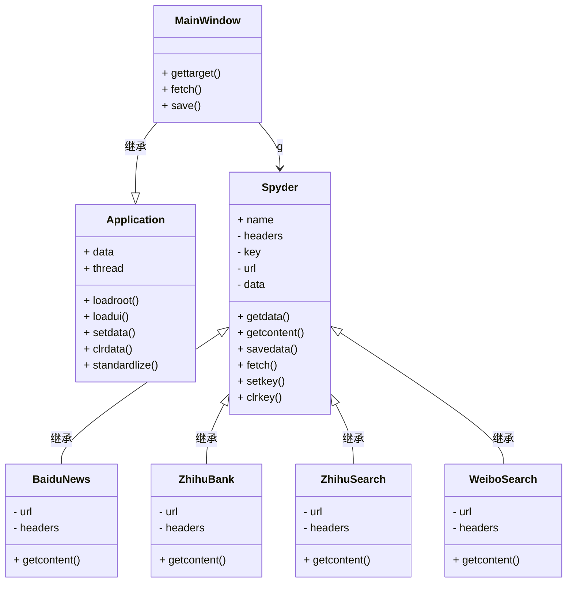
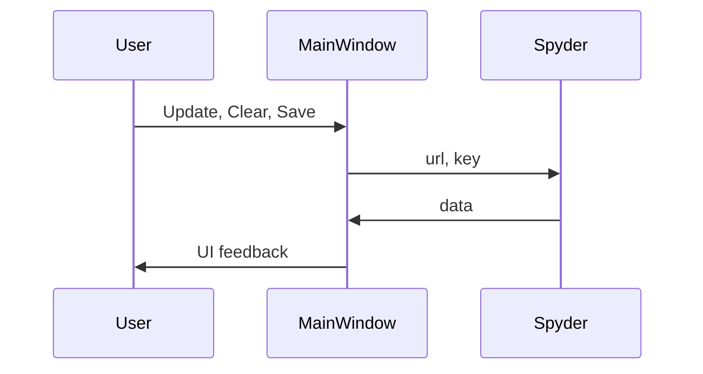

## 1. Description

> 项目基于tkinter开发，采用类的模块化开发，Interface为界面文件，Spyder为爬虫逻辑文件，Main为主程序文件，基本功能已实现，但附加功能为完成。

## 2. Design

### 2.1 Sketch

> 状态栏待添加

<svg width="620" height="420">  
    <rect x="10", y="10", width="600" height="400" style="fill:transparent;stroke-width:2;stroke:black" />
    <text fill="red" font-size="25" x="180" y="60">TableView</text>
    <rect x="30", y="30", width="420" height="360" style="fill:transparent;stroke-width:2;stroke:black" />
    <rect x="470", y="30", width="120" height="360" style="fill:transparent;stroke-width:2;stroke:black" />
    <text fill="red" font-size="20" x="500" y="60">Infolist</text>
    <rect x="30", y="392", width="560" height="16" style="fill:transparent;stroke-width:1;stroke:black" />
    <text fill="red" font-size="16" x="30" y="405">StateBar</text>
</svg>

### 2.2 UML

> 程序类图
>

> 业务流程图
>

## 3. Problem

> 1. ArchLinux加载速度太慢；线程检查，若已经在运行，点击时提示正在加载中；实时加载进度反馈在状态栏中；
> 2. 点击表头排序未上线；
> 3. 编码格式有问题，中文未能正常显示；
> 4. 界面风格色彩更换未上线；
> 5. 点击记录查看详情；
> 6. 滚动条无法正常运行；