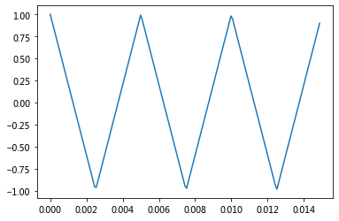
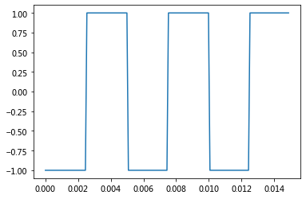

#  第一章 声音和信号

## 综述

> **信号代表随着时间变化的量。**声音源自于空气压力的改变。声音信号代表的是空气压力随着时间的变化。
>
> 传声器是测量上述变化并产生表示所测声音的电信号的设备。扬声器是通过输入的电信号产生声音的设备。传声器和扬声器都被称为换能器，因为它们将信号从一种形式转化成另一种形式，也就是变换了能量的形式。
>
> **这套方法同样可以应用于随空间而不是时间变化的信号，或者是不止一个维度的信号**，本书着重于一维声音信号的介绍，其方法也可以用于其他各个领域的信号。

## 1. 周期信号

> 周期信号是在一段时间后重复出现的信号，对周期信号的描述，与正弦函数大致类似，但形状更加复杂。周期信号的形状称为波形。波形的形状决定了音乐的音色，也就是我们对声音品性的感受。

## 2. 频谱分析

> 本书最重要的主题是**频谱分析**。根据**离散傅里叶变换(Discrete Fourier Transform, DFT)**，任何信号都可以表示成一系列不同频率的正弦信号的叠加和，在这个意义下，DFT能将信号转换为频谱，这个集合称为**频谱**。频谱图中的纵坐标表示合成这个信号的正弦波**频率范围**，横坐标表示各个正弦波的频率元素的强度，或者说是**振幅**。
>
> 本书最重要的算法是**快速傅里叶变换(Fast Fourier Transform, FFT)**，它是计算离散傅里叶级数变换的一种高效方式。
>
> 频率最低的元素被称为**基频**，拥有最高的幅度的元素被称为**主频**。通常情况下，感知到的声音的音高是由其基频决定的，即使它不是主频。频谱中其他频率为基频的整数倍的元素被称为**谐波**，因为他们在乐理概念上跟基频和谐。

## 3. 波形的读写

> thinkdsp提供的`read_wave`可以读取WAV文件并返回一个wave对象，同时wave对象可以通过`write`方法来写入wav文件。

至于wav文件的播放，可以通过thinkdsp.play_wave实现，但是限于播放器等因素，暂无法正常使用。

```python
wave = thinkdsp.read_wave("sound.wav")
wave.write(filename="sound2.wav")
thinkdsp.play_wave(filename="sound2.wav", player="aplay")
```

## 4. 频谱

Wave提供了make_spectrum，它返回的是Spectrum对象，同时Spectrum提供了plot方法，Spectrum提供了3种修改频谱的方法。

> + **low_pass**，它加载一个低通滤波器，也就是说高于给定的截止频率的频率元素被按照一定因素衰减（也就是在大小上降低）。
> + **high_pass**，它加载了高通滤波器，也就是说低于某个截止频率的元素被衰减量。
> + **band_stop**，它让处于两个截止频率之间的波段内的频率元素衰减了。


# 第二章 谐波

> 通过观察它们的频谱来理解它们的谐波结构，也就是构成它们的三角函数集合的结构。本章还要介绍数字信号处理中最重要的现象之一：混叠。同时解释一下Spectrum类的工作原理。

## 1. 三角波

一个正弦波仅包括一个频率元素，所以其频谱只有一个尖峰。对于更加复杂的波形，如小提琴的录音，其DFT的结果中有很多尖峰。

我们可以通过`thinkdsp.TriangleSignal`来生成三角波，这个频谱的另一个特征在于谐波的幅度于频率的关系。

```python
class	TriangleSignal( Sinusoid):
  	def evaulate(self, ts):
      	cycles = self.freq * ts + self.offset / PI2
        frac, _ = np.modf(cycles)
          ys = np.abs( frac - 0.5)
          ys = normalize(unbias(ys), self.amp)
          return ys
```



## 2. 方波

thinkdsp还提供了SquareSignal，用来处理方波。

```python
class	SquareSignal( Sinusoid):
  	def evaulate(self, ts):
      	cycles = self.freq * ts + self.offset / PI2
        frac, _ = np.modf(cycles)
          ys = np.abs( frac - 0.5)
          ys = normalize(unbias(ys), self.amp)
          return ys
```



## 3. 混叠

> 折叠频率

## 4. 计算频率

```python
from np.fft import rfft, rfftfreq

class	Wave:
  	def make_spectrum(self):
      	n = len(self.ys)
        d = l / self.framerate
        hs = rfft(self.ys)
        fs = rfftfreq(n, d)
          return Spectum(hs, fs, self.framerate)
```

> 参数self是一个Wave对象。n为波形的采样数，而d是采样频率的频率的倒数，也就是样本间的时间差。
>
> `np.fft`是Numpy模块，提供快速傅里叶变换(FFT)的相关函数，这是一种计算离散傅里叶变化的高效算法。
>
> make_spectrum使用了rfft，其意义是“傅里叶变换实数部分”，因为Wave只有实数值，而没有复数值。

