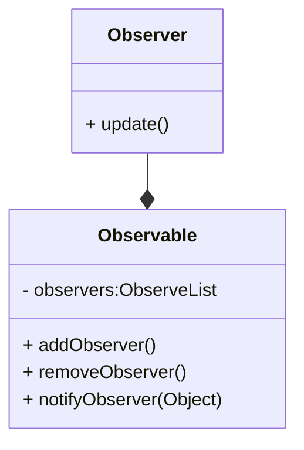
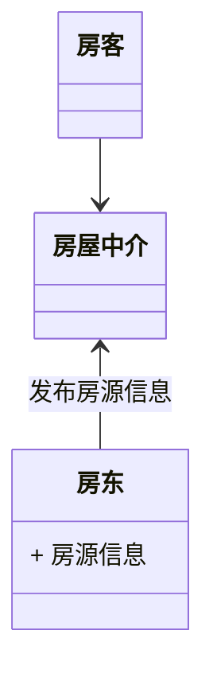

 

# Chapter1 Synopsis

## 1. What's DesignPattern

**设计模式**最初是被 GoF 于 1995 年提出的，GoF（Gang of Four，四人帮）即 Erich Gamma、Richard Helm、Ralph Johnson和John Vlissides。他们四人于 1995 年出版了一本书《Design Patterns：Elements of Reusable Object-Oriented Software》（翻译成中文是《设计模式 可复用面向对象软件的基础》），第一次将设计模式提升到理论高度，并将之规范化，该书提出了 23 种经典的设计模式。

**设计模式（Design Pattern）是一套被反复使用、多数人知晓的、无数工程师实践的代码设计经验的总结**，它是面向对象思想的高度提炼和模板化，使用设计模式是为了让代码具有更高的可重用性，更好的灵活性和可拓展性，更易被人阅读和理解。GoF 提到的模式有四个基本要素：

> - 模式名称：助记名，方便讨论、交流、传播；
> - 问题：该模式是用来解决哪类实际问题，即它的应用场景；
> - 解决方案：设计的组成部分，它们之间的相互关系及各自的职责和协作方式；
> - 效果：使用模式能达到的效果，即对使用条件的权衡取舍。


## 2. UML

> UML（Unified Modeling Language）称为统一建模语言或标准建模语言，是面向对象软件的标准化建模语言。UML 规范用来描述建模的概念有：类（对象的）、对象、关联、职责、行为、接口、用例、包、顺序、协作以及状态。
>
> UML **类图**表示不同的实体（人、事物和数据）如何彼此相关, 基本的关系包括泛化、实现、组合、聚合、关联、依赖。

### **依赖（Dependency）**

> 实体之间一个“使用”关系暗示一个实体的规范发生变化后，可能影响依赖于它的其他实例。 更具体地说，它可转换为对不在实例作用域内的一个类或对象的任何类型的引用。其中包括一个局部变量，对通过方法调用而获得的一个对象的引用（如下例所 示），或者对一个类的静态方法的引用（同时不存在那个类的一个实例）。也可利用“依赖”来表示包和包之间的关系。由于包中含有类，所以你可根据那些包中的 各个类之间的关系，表示出包和包的关系。

### **关联（Association）**

> 实体之间的一个结构化关系表明对象是相互连接的。箭头是可选的，它用于指定导航能力。如果没有箭头，暗示是一种双向的导航能力。在Java中，关联转换为一个实例作用域的变量。可为一个关联附加其他修饰符。多重性（Multiplicity）修饰符暗示 着实例之间的关系。在示范代码中，Employee可以有0个或更多的TimeCard对象。但是，每个TimeCard只从属于单独一个 Employee。 

### **聚合（Aggregation）**

> 聚合是关联的一种形式，代表两个类之间的整体/局部关系。聚合暗示着整体在概念上处于比局部更高的一个级别，而关联暗示两个类在概念上位于相同的级别。聚合也转换成Java中的一个实例作用域变量。
>
> 关联和聚合的区别纯粹是概念上的，而且严格反映在语义上。聚合还暗示着实例图中不存在回路。换言之，只能是一种单向关系。

### **合成（Composition）**

> 合成是聚合的一种特殊形式，暗示“局部”在“整体”内部的生存期职责。合成也是非共享的。所以，虽然局部不一定要随整体的销毁而被销毁，但整体要么负责保持局 部的存活状态，要么负责将其销毁。局部不可与其他整体共享。但是，整体可将所有权转交给另一个对象，后者随即将承担生存期职责。
>
> Employee和TimeCard的关系或许更适合表示成“合成”，而不是表示成“关联”。

### **泛化（Generalization）**

> 泛化表示一个更泛化的元素和一个更具体的元素之间的关系。泛化是用于对继承进行建模的UML元素。

### **实现（Realization）**

> 实例关系指定两个实体之间的一个合同。换言之，一个实体定义一个合同，而另一个实体保证履行该合同。对Java应用程序进行建模时，实现关系可直接用implements关键字来表示。


# Chapter2 监听模式

## 1. Synopsis

> 监听模式又名观察者模式，顾名思意就是观察与被观察的关系，其基本运作原理为**在对象见定义一种一对多的依赖关系，当这个对象状态发生改变时，所有依赖它的对象都会被通知并自动更新**。

观察者模式是对象的行为模式，又叫发布-订阅（Publish/Subscribe）模式、模型-视图（Model/View）模式、源-监听器（Source/Listener）模式或从属者（Dependents）模式。当你看这些模式的时候，不要觉得陌生，它们就是观察者模式。

观察者模式一般是一种一对多的关系，可以有任意个（一个或多个）观察者对象同时监听某一个对象。监听的对象叫观察者（后面提到监听者，其实就指观察者，两者是等价的），被监听的对象叫被观察者（Observable，也叫主题 Subject）。被观察者对象在状态或内容发生变化时，会通知所有观察者对象，使它们能够做出相应的变化（如自动更新自己的信息）。

## 2. 设计要点

在设计观察者模式的程序时要注意以下几点：

> 1. 要明确谁是观察者谁是被观察者，只要明白谁是关注对象，问题也就明白了。一般观察者与被观察者之间是多对一的关系，一个被观察对象可以有多个监听对象(观察者)。如一个编辑框，有鼠标点击的监听者，也有键盘的监听者，还有内容改变的监听者。
> 2. Observable 在发送广播通知的时候，无须指定具体的 Observer，Observer 可以自己决定是否要订阅 Subject 的通知。
> 3. **被观察者至少需要有三个方法：添加监听者、移除监听者、通知 Observer 的方法；观察者至少要有一个方法：更新方法，更新当前的内容，作出相应的处理。**
> 4. 添加监听者、移除监听者在不同的模型称谓中可能会有不同命名，如观察者模型中一般，addObserver，removeObserver；在源-监听器（Source/Listener）模型中一般是 attach/detach，应用在桌面编程的窗口中，还可能是 attachWindow/detachWindow，或 Register/UnRegister。不要被名称迷糊了，不管他们是什么名称，其实功能都是一样的，就是添加/删除观察者。



## 3. 应用分类

观察者模式根据其侧重的功能还可以分为推模型和拉模型。

**推模型**：被观察者对象向观察者推送主题的详细信息，不管观察者是否需要，推送的信息通常是主题对象的全部或部分数据。一般这种模型的实现中，会把被观察者对象中的全部或部分信息通过 update 的参数传递给观察者 [update(Object obj) ，通过 obj 参数传递]。

> 如某应用 App 的服务要在凌晨1:00开始进行维护，1:00-2:00期间所有服务将会暂停，这里你就需要向所有的 App 客户端推送完整的通知消息：“本服务将在凌晨1:00开始进行维护，1:00-2:00期间所有服务将会暂停，感谢您的理解和支持！” 不管用户想不想知道，也不管用户会不会在这段期间去访问，消息都需要被准确无误地通知到。这就是典型的推模型的应用。

**拉模型**：被观察者在通知观察者的时候，只传递少量信息。如果观察者需要更具体的信息，由观察者主动到被观察者对象中获取，相当于是观察者从被观察者对象中拉数据。一般这种模型的实现中，会把被观察者对象自身通过 update 方法传递给观察者 [update(Observable observable )，通过 observable 参数传递 ]，这样在观察者需要获取数据的时候，就可以通过这个引用来获取了。

> 如某应用 App 有新的版本推出，则需要发送一个版本升级的通知消息，而这个通知消息只会简单地列出版本号和下载地址，如果你需要升级你的 App 还需要调用下载接口去下载安装包完成升级。这其实也可以理解成是拉模型。

推模型和拉模型其实更多的是语义和逻辑上的区别。我们上面的代码框架，从接口 [update(self, observer, object)] 上你应该知道是可以同时支持推模型和拉模型的。推模型时，observer 可以传空，推送的信息全部通常 object 传递；拉模型时，observer 和 object 都传递数据，或只传递 observer，需要更具体的信息时通过 observer 引用去取数据。

## 4. 应用场景

> 1. 对一个对象状态或数据的更新需要其他对象同步更新，或者一个对象的更新需要依赖另一个对象的更新；
> 2. 对象仅需要将自己的更新通知给其他对象而不需要知道其他对象的细节，如消息推送。

学习设计模式，更应该领悟其设计思想，不应该应该局限于代码的层面。 观察者模式还可以用于网络中的客户端和服务器，比如手机中的各种 App 的消息推送，服务端是被观察者，各个手机 App 是观察者，一旦服务器上的数据（如 App 升级信息）有更新，就会被推送到手机客户端。在这个应用中你会发现服务器代码和 App 客户端代码其实是两套完全不一样的的代码，它们是通过网络接口进行通迅的，所以如果你只是停留在代码层面是无法理解的！


# Chapter3 状态模式

## 1. Synopsis

> 允许一个对象在其内部状态发生改变时改变其行为，使这个对象看上去就像改变了它的类型一样。

如水一般，状态即事物所处的某一种状态。**状态模式是说一个对象在其内部状态发生改变时。其表现的行为和外在属性不一样，这个对象看上去像是改变了它的类型一样。**因此，状态模式又称为对象的行为模式。

## 2. 设计要点

> 在实现状态模式的模式,实现的场景状态有时候非常复杂,决定状态变化非常多，我们可以把决定状态变化的属性单独抽象成一个类，这样判断状态属性是否符合当前状态是就可以传入更多的信息。每一种状态应当只有唯一的实例。

## 3. 特点

### 优点

> 1. 封装了状态的转换规则，在状态模式中可以将状态的转换代码封装在环境类中，对状态转换代码进行记住集中管理，而不是分散在一个个业务逻辑中；
> 2. 将所有与某个状态有关的行为放到一个类中，使开发人员只专注于在该状态下的逻辑开发；
> 3. 允许状态转换逻辑与状态对象合为一体，使用时只需要注入一个不同的状态即可使环境对象拥有不同的行为；

### 缺点

> 1. 会增加系统类和对象的个数；
> 2. 状态模式的结构与实现都较为复杂，如果使用不当容易导致程序和代码的混乱；

## 4. 应用场景

> 1. 一个对象的行为取决于它的状态，并且它在运行时可能经常改变它的状态，从而改变它的行为；
> 2. 一个操作中含有庞大的多分支的条件语句，这些分支依赖于该对象的状态，且每一个分支的业务逻辑都非常复杂时，我们可以使用状态模式来拆分不同的分支逻辑，使程序有更好的可读性和可维护性；


# Chapter4 中介模式

## 1. Synopsis

> 用一个中介对象来封装一系列的对象交互，中介者使各对象不需要显示地相互调用，从而使其耦合松散，而且可以独立地改变它们之间的交互。

由中介来承接房客和房东之间的交互过程，可以使得整个过程畅通、高效。这在程序中叫做中介模式，又称为调停模式。

## 2. 设计要点

> 中介模式主要有三个类，包括交互对象(InteractiveObject)，中介者(Mediator)和具体中介者(Mediator)。



## 3. 特点

### 优点

> 1. 简化了交互过程；
> 2. 提高了交互效率；

### 缺点

> 1. 会增加中介者的复杂度，使得最终中介系统难以维护；
> 2. 系统过于依赖中介者，降低了系统的稳定性；

## 4. 应用场景

> 1. 一组对象一定义良好但复杂的方式进行通信。
> 2. 一个对象引用其他很多对象并且直接与这些对象通信，导致难以复用；
> 3. 想通过一个中间类来封装多个类的中间行为，同时又不想生成太多子集；


# Chapter5 装饰模式

> 动态地给一个对象增加一些额外的职责，就拓展对象功能来说，装饰模式比生成子类的方式更为灵活。


# Chapter6 单例模式

> 确保一个类只有一个实例，并且提供一个访问它的全局方法。

单例模式就是确保一个类有且只有一个对象的一种机制。单例模式用来控制某些事物只允许有一个个体。常用的实现方法除了以下的重载`new`方法外还包括重载`call`方法和装饰器等。

```python
class Singleton(object):
    """单例实现方式一"""
    __instance = None
    __isFirstInit = False
    
    def __new__(cls, name):
        if not cls.__instance:
            Singleton.__instance = super().__new__(cls)
        return cls.__instance
    
    def __init__(self, name):
        if not self.__isFirstInit:
            self.__name = name
            Singleton.isFirstInit = True
            
    def gatName(self):
        return self.__name
```


# Chapter7 克隆模式

> 用原型实例指定要创建对象的种类并通过**拷贝**这些原型属性来创建新的对象。

通过**拷贝**（深或浅拷贝）自身的**所有**属性来创建新对的过程叫克隆，又称原型模式，其包括两个过程，分配与拷贝，这个模式在创建对象时，不会执行类的初始化函数。

```python
from copy import copy, deepcopy


class Clone:
    """克隆的基类"""
    
    def clone(self):
    	"""浅拷贝的方式克隆对象"""
    	return copy(self)
    
    def deepClone(self):
        """深拷贝的方式克隆对象"""
        return deepcopy(self)
```


# Chapter8 职责模式

> 为避免请求发送者与接收者耦合在一起，让多个对象都有可能接收请求。将这些接收对象连成一条链，并沿着这条链传递请求，直到有对象处理它为止。

职责模式又称责任链模式，它将请求的发送者和接收者耦合了。客户端不需要知道请求处理者的明确信息和处理的具体逻辑，甚至不需要知道链的结构，它只需要将请求进行发送即可。

```python
class Request:
    """请求(内容)"""
    def __init__(slef, name, dayoff, reason):
        self.__name = name
        self.__dayoff = dayoff
        self.__reason = reason
        self.__leader = None
        
   	def getName(self):
        return self.__name
    
    def getDayOff(self):
        return self.__dayoff
    
    def getReason(self):
        return self.__reason
    
    
class Responsible:
    """责任人"""
    def __init__(self, name, title):
        self.__name = name
        self.__title = title
        self._nextHandler = None
        
    def getName(self):
        return self.__name
    
    def getTitle(self):
        return self.__title
    
    def setNextHandler(self):
        self._nextHandler = nextHandler
        
    def handleRequest(self, request):
        """请求处理"""
        self._handleRequestImpl(request)
        if (self._nextHandler is not None):
            self._nextHandler.handleRequest(request)
            
    def _handleRequestImpl(self, request):
        """真正处理请求的办法"""
        pass
        
```


# Chapter9 代理模式

> 为其他对象提供一种代理以控制对这个对象的访问。

一个对象需要通过对另一个对象的引用来完成某项动作或者任务的模式，称为代理模式。其核心思想是使用一个额外的间接层来支持分散的、可控的、智能的访问，同时增加一个包装和委托来保护真实的组件，以避免过度复杂。常用于对象不能或者不想直接被引用，对一个对象的功能进行加强和特殊用途代理如网络代理等。

```python
class Subject:
    """主题类"""
    def __init__(self, name):
        self.__name = name
    
   	def getName(self):
        return self.__name
    
    def request(self, content="")
    	pass
    
    
class RealSubject(Subject):
    """真实主题类"""
    
    def request(self, content):
        print("RealSubject todo something...")
        
        
class ProxySubject(Subject):
    """代理主题类"""
    
    def __init__(self, name, subject):
        super().__init__(name)
        self._realSubject = subject
        
    def request(self, content=""):
        self.preRequest()
        if (self._realSubject is not None):
            self._realSubject.request(content)
        self.afterRequest()
        
    def preRequest(self):
        print("preRequesrt")
        
    def afterRequest(self):
        print("afterRequest")
```


# Chapter10 外观模式

> 为子系统中的一组接口提供一个一致的界面称为外观模式，外观模式定义了一个高层接口，这个接口使得这一子系统更容易使用。

外观模式的核心在于用一个简单的接口来封装一个复杂的系统，使这个系统更容易使用。外观模式（API？）虽然很简单，但是确是非常常用的模式。在软件的层次化结构中，可以使用外观模式来定义每一层系统的调用接口，层与层之间不能产生直接联系，而通过外观类建立联系，降低曾之间的耦合度，它便于系统的维护和管理，但却降低了系统功能的灵活性，这也是它常用的应用情景。


# Chapter11 迭代模式

> 提供一种方法顺序地访问一组聚合对象（一个容器）中的各个元素，而又不需要暴露该对象的内部细节。

迭代模式又称为迭代器模式，迭代器其实就是一个指向容器的指针，这个指针可以返回当前所指元素，可以移动到下一个元素的位置，通过这个指针可以遍历容器中的所有元素，迭代器一般至少有两种方法，获取当前指针与移至下一个指针。常用于内部结构较复杂，需要为一系列聚合对象提供多种不同的访问方式的情景。

```python
class BaseIterator:
    """迭代器"""
    
    def __init__(self, data):
        self.__data = data
        self.toBegin()
    
    def toBegin(self):
        """指针移至起始位置"""
        self.curIdx = -1
        
    def toEnd(self):
        """指针移至结尾位置"""
        self.__cuIdx = len(self.__data)
        
    def next(self):
        """移动至下一个元素"""
        if (self.__curIdx < len(self.__data)-1):
            self.__curIdx += 1
        	return True
       	else:
            return False
        
    def previous(self):
        """移动至上一个元素"""
        if (self.__curIdx > 0):
            self.__curIdx -= 1
        	return True
       	else:
            return False
        
    def current(self):
        """获取当前元素"""
        return self.__data[self.__curIdx] if (self.__curIdx < len(self.__data) and self.__curIdx >= 0) else None
```


# Chapter12 组合模式

> 将对象组合成树形结构以表示“整体-部分”的层次结构。组合使得用户对单个对象和复合对象的使用具有一致性。

在设计组合模式时，要充分理解各个部分与整体的关系，了解对象的组成结构。组合模式可以自由增减组件，结构简单易于调用，但层次结太深时整体结构会异常复杂。
