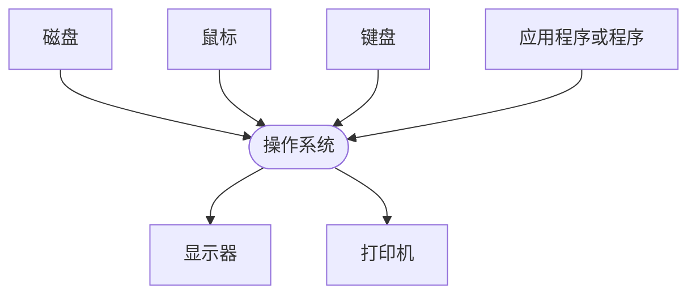

# 前言

> 本书以介绍Python背景知识以及基本语法为主。

# 第一章 电子计算机简介

## 1.1 简介

“电子计算机”这个词很久以前被用来指代制作数学图表和解决复杂计算的人。人们相信第一台计算机诞生于1936年的柏林。

个人计算机（PC）是提供个人使用的计算机。个人计算机可以分为台式计算机、**工作站**和笔记本电脑。个人计算机主要有以下五种应用程序：

> 1. Web浏览器
> 2. 数据压缩软件
> 3. Windows媒体播放软件
> 4. 图像编辑软件
> 5. 音频编辑软件

## 1.2 冯·诺依曼理念

冯·诺依曼架构的基本结构包括**内存**、**处理单元**和**控制单元**。

冯·诺依曼理念架构的特征如下：

(1) 硬件系统的组成：

+ **内存**

> 在冯·诺依曼理念中，主存储系统——随机访问存储器（Random Access Memory, RAM）用于存储数据或程序。

+ **算术逻辑单元**

> 顾名思义（Arithmetic Logic Unit， **ALU**），这个部件用于算术和逻辑运算。

+ **控制单元**

> 中央处理器（Central Processing Unit， **CPU**）中由控制单元（Control Unit，**CU**）管理数据或程序的处理。控制单元用来完成程序的执行，例如，取指令-译码-执行（冯·诺依曼运行周期）

+ **输入/输出系统**

> 通过这个系统给定输入，并在程序执行之后生成输出结果。信息可存储在光盘、软盘等介质中。

(2) 数据或程序被存储到主存储器中；

(3) 指令是按顺序处理的。

### 1.2.1 计算机的简单模型

计算机系统拥有以下三个基本组成部分：

> **(1) 处理器**
>
> 也被称为中央处理器。处理器是计算机的大脑。它使用算术逻辑单元中的算术或者逻辑运算符处理从输入获取的数据，从而将数据转换为输出；
>
> **(2) 存储器**
>
> 存储器指永久性和临时性数据存储。计算机的存储器只能识别0和1这两个字符。临时性存储器被称为**随机访问存储器(RAM)**，永久性存储器被称为**只读存储器(Read Only Memory, ROM)**。
>
> **(3) 输入/输出**
>
> 指通信机制。输入或输出设备时计算机配件的重要组成部分。输入设备将外部资源的数据提供给计算机，输出设备在处理输入的数据之后为用户生成信息。
>
> ```mermaid
> graph LR
> 输入 --> A[处理 ] --> 输出
> A --> B[存储]
> B --> A
> en
> ```
>
> ### 1.2.2 电子计算机的组成
>
> 电子计算机组件：
>
> (1) 输入设备
>
> 这些设备用来给计算机提供信息。输入设备分不同的种类，例如键盘、鼠标、扫描仪、触控板等。
>
> (2) 输出设备
>
> 这些设备用来向用户展现输出结果。输出设备可分为不同的种类，例如打印机、扬声器、显示屏等。
>
> (3) 处理单元
>
> 中央处理器是计算机的大脑。它从输入获取并处理数据，从而将数据转换为输出。中央处理器包括以下内容：
>
> > + ALU	ALU执行算术和逻辑运算，包括加法、减法、除法以及位运算；
>> + **寄存器**    寄存器存储中央处理器中的数值。每一个寄存器都有一个唯一的名称并且可以存储一个字节或一个词的数据；
> > + 控制单元    控制单元基于内存中的指令控制中央处理器的运算、存储器以及输入/输出设备。
> 
> **(4) 外置存储器**
>
> 外置存储器是用来存储程序(指令集合)或临时性和永久性数据的设备，可以在一些计算机或者一些电子设备上，分为以下两种类型：
>
> > + **一级存储器**	一级存储器也被称为主存储器。程序在执行之前，首先被加载到主存储器中。由于主存储器中的信息在关闭计算机电源后会丢失，因此，主存储器天生是易变的。
>> + **二级存储器**    二级存储器也称辅助存储器，是稳定的低速存储器。这个存储器中的信息即使在计算机由于故障关闭后也不会丢失。二级存储器包括硬盘、DVD、软盘等。
> 
> (5) 总线
>
> 在计算机中，所有组件都是用电缆线连接起来的。每一根电缆线一次只能发送一位数据。这些电缆线被称为总线，并负责数据从输入设备到输出设备的传输。

基本上，计算机由软件和硬件两个部分组成。软件拥有所有让计算机与运行的指令和信息，包括操作系统和应用程序。硬件拥有所有让计算机运行的物理元素，包括CPU、RAM、ROM和Cache等。

---

## 1.3 存储器

“存储器”这个词是指可以保存计算机程序和数据的存储器。存储器主要分为两种类型：主存储器和辅助存储器。

### 1.3.1 主存储器

因为它是一种短期存储器，所以也被称为临时性存储器。主存储器包括以下三种：

+  RAM	RAM是计算机种非常重要的一部分。它存储着可供CPU存取的数据。RAM保存了当前正在使用的程序或数据。这个存储器本身是易变的，因为存储于上面的数据在计算机电源被关闭之后丢失。RAM也被称为工作内存或主内存。
+ ROM    ROM得名于计算机只能从其上读取信息而不能向其中写入数据。操作系统的一部分是存储在ROM中的。启动计算机系统时，CPU会执行存储在ROM中的指令。存储在ROM中的信息是不能改变的，这些信息即使在关闭计算机之后也不会丢失。
+ **高速缓冲存储器**    高速缓冲存储器存储了最近被CPU处理过的数据。高速缓存的容量非常小并且执行速度非常快。处理一个应用程序时，处理器首先会检索高速缓存，然后检索RAM。

### 1.3.2 辅助存储器

辅助存储器也被称为永久性存储器。对于计算机系统来说，他不是可以持续访问的设备。当需要时，辅助存储设备和介质在被插入到计算机上之后可以被访问到。辅助存储器包括硬盘、DVD和存储卡等。因为存储在辅助存储器上的数据在关闭计算机之后仍要得以保留，所以它是一种长期存储器。

以下是不同类型的辅助存储器：

(1) **硬盘**    硬盘或者硬盘驱动器（Hard Disk Drive，HDD）将大量的数据存储在一个或多个电磁表面上，并且提供相当快捷地数据访问。

(2) **闪存**    闪存可以通过插入到USB接口来检索和存储数据。它非常小巧，方便携带。

(3) **存储卡**    存储卡是一个非常小的数据存储介质，它非常便携并且可以在远程计算机设备中使用。

(4) **压缩光盘**    压缩光盘是一种用于存储数据的光盘，其数据的访问速度压迫比软盘快，但比硬盘慢。压缩光盘存储和软盘一样的数据。

现在一般的硬盘容量在3GB到20多GB之间，软盘的容量为1.44MB多，光盘(CD-ROM)的最大容量大约是650MB。

### 1.3.3 寄存器

寄存器存储了存放数据的内存地址并被CPU频繁访问。CPU寄存器的数量决定了CPU的速度。

计算机中存储的层次结构是按存储空间排列的。存储的层次结构中每一层都可以根据响应时间来区分。

---

## 1.4 编程语言

编程语言是一种程序开发人员用于编写计算机考研理解iang执行的指令的编码语言。

编程语言是用来让计算机理解用户意图的。用户使用计算机语言编写程序。以下描述了三种类型的计算机编程语言。

### 1.4.1 高级语言

使用符号言语是非常复杂的，因为每条机器指令都需要单独编写。另一方面，高级语言用来类似英语的语言让程序开发人员专注于应用程序本身的问题而不是某个具体计算机的复杂问题。高级语言通过利用一个名为翻译器的转换软件被转换成机器级别的语言。他是一种不要求程序开发人员投入过多精力的计算机编程语言，因为接近用户，所以它被称为高级语言。

### 1.4.2 汇编语言

汇编语言是一种底层编程语言。它对机器更为友好，但是需要程序开发人员投入更多的精力。汇编（符号）语言非常类似于机器语言。改语言用符号和注记符来表示多种机器指令。汇编语言可以直接被转换成二进制语言并且是依赖于机器的。

汇编语言使用了符号，所以被称为符号语言。因为计算机不能理解符号语言，所以需要一个汇编翻译器的程序将符号代码翻译成机器语言。这也是称它为汇编语言的原因。

### 1.4.3 机器语言

机器语言只包括0和1，是早期编程语言的模式。机器语言是一种底层计算机编程语言，对机器更友好，因为更接近机器，所以这种语言被称为机器语言。


## 1.5 翻译器

翻译器是一个可以立即翻译任何语言的计算机程序。为了调试和执行程序，它能将编程语言转换为机器语言。以下为三种类型的翻译器程序：

### 1.5.1 编译器

> 编译器对于应用程序性能的提升是很重要的。一种语言的编译器是指一种将用计算机编程语言百年写的应用程序的源代码转换为二进制形式的目标语言的计算机程序。
>
> 编译器会检查程序源代码的语法错误。二u过没有找到错误，这个程序就会被声明为编译成功。如果一个程序没有包含任何语法错误，编译器就将程序的源代码翻译成计算机的机器语言。
>
> 源文件是程序开发人员创建的程序文件。它包括了程序开发人员编写的信息和指令，这些信息和指令会在编译的过程中被翻译器检查。源文件被编译器编译并作为一个可执行文件运行。

### 1.5.2 汇编器

我们需要使用翻译器将汇编语言翻译成机器语言，翻译器也被称为汇编器。每种汇编语言对于特定的计算机架构都是唯一的。对于汇编语言种所有的运算，我们会使用一些注记符，例如加、减、乘等。

### 1.5.3 解释器

> 类似于编译器，解释器也是将高级语言翻译成底层的机器语言。解释器读取一条语句，在读取下一条语句之前会先将当前读取的语句转换成中间代码并且执行。它会直接逐条翻译每条命令。由于解释器在翻译每条指令时存在等待时间，因此这是个相对较慢的过程。
>
> 解释器遇到一个错误时会停止执行并上报错误，相反编译器即时在遇到多个错误的情况下也会读取整个程序。


## 1.6 硬件和软件

硬件是指由软件驱动运行的有形物体。软件是指计算机中的一个指令集合。软件在没有硬件的支持下时不能运行的，反之亦然。

### 1.6.1 硬件

> 硬件是系统的物理组成部分。硬件的组件包括几个部分：输入设备、CPU、主存储器、输出设备、辅助存储器。

### 1.6.2 软件

> 计算机软件是一个程序的集合，用于管理计算机的整个文件系统。计算机软件被分两种：系统软件和应用软件。
>
> 1.  **系统软件**
>
>    系统软件在用户和硬件之间提供了接口。同时，它也管理着系统资源，使所有的硬件组件正常运转。系统软件在程序的辅助下管理着计算机的硬件资源。系统软件有以下三种类型：
>
> + **操作系统**	它在用户与硬件之间提供了接口，用于管理所有的文件和文件夹，并且可以用它方便地访问数据库。操作系统是的计算机可以高效运行。
> + **系统支持软件**    它提供了操作系统和系统工具的所有服务。
> + **系统开发软件**    它的作用类似于语言编辑器，为了调试和执行程序，它将程序语言转换成机器语言级别的语言。
>
> 2. **应用软件**
>
>    应用软件使在系统软件下运行，用于帮助用户解决问题。它可以被进一步分为通用软件和专用软件。
>
> + 通用软件	它是可以被多种程序语言使用的软件。
> + 专用软件   指具有特殊用途的软件。

## 1.7 操作系统

操作系统使程序运行的一个软件环境。大多数操作系统被描述为软件和底层硬件的结合体。操作系统就像硬件和用户的接口，除了结合类似于互联网协议的通讯系统提供接口外，害控制着文件和数据库的访问。硬件和软件只有通过操作系统才能一起工作。它是计算机最初始的状态。计算机的每一个部件的工作都依赖于操作系统。

操作系统的主要功能：

> 1. 操作系统的主要目的是确保计算机系统高效运行并激活各种硬件设备；
> 2. 操作系统执行基础的任务，如从键盘获取输入等；
> 3. 操作系统可以使得用户进行多任务处理，多任务处理是指多个程序同时在一个操作系统上运行；
> 4. 操作系统也可以让用户多线程处理，多线程是指一个程序的多个线程同时运行在一个操作系统；
> 5. 用户可以利用命令和操作系统进行交互。




# 第二章 解决问题的策略

## 2.1 分析问题

解决问题之前，我们要分析问题，以下是几个分析问题的关键：

**(1) 可分解/不可分解** 

> 分析一个问题是否可以被分解。

**(2) 解决步骤-可以/不可以被忽略**

当解决问题时，确认我们是否可以忽略一些步骤时非常重要的。在这个关键维度的基础上，问题可以被分为以下几类：

> + 可忽略	对于可以忽略的问题，因为一些步骤对于解决问题是否不是非常重要，所以这些步骤是否可以忽略的。
> + 可恢复    可恢复的问题是那些可以通过之前的执行步骤很容易回速的问题。
> + 不可恢复    对于不可恢复的问题，我们不能回溯到之前的执行步骤。因此，谨慎地解决这类问题非常有必要。

**(3) 可预测/不可预测**

> 这个维度决定了问题的确定或者不确定因素。

**(4) 优秀的解决方法相对/绝对**

确定为了找到最好的解决方案，我们是否要尝试得到最优的方法或想法是非常重要的。只有基于这个决定，才能应用适合的技术得到最好的解决方案。

### 2.1.1 问题的正式定义

问题可以被定义为实际情况与期望情况之间的差距。它是一个没有满足的用户需求。

### 2.1.2 解决问题的方法论

构建解决方案的过程包括结构图、伪代码和流程图的构建。结构图用于构建整个程序，流程图或伪代码用于构建程序的各个部分。这些部分也被称为模块。

> + **结构图**	结构图是一个演示了程序功能流程的层次体系。
> + **伪代码**    使用类似英语的语法来表达算法，伪代码是非常易于理解的，他们用来描述算法的设计。
> + **流程图**    流程图是数据逻辑流程的图形表示。它使用标准的图形符号来描述具体的模块的流程顺序。

## 2.2 算法

在计算机科学与数学中，算法是用于一步步解决问题的命令的集合。这一步步的说明就是算法。

> + **算法是有限并且有序的步骤序列；**
> + 它是独立于任何语言的对流程的描述；
> + 它可以被很多不同的语言通过不同的方法和程序实现。

# 附注

## 面向对象编程

众所周知，Python是一门面向对象的编程语言，并且提供了面向对象变成需要的所有功能。面向对象编程主要侧重于对象和类，二面向过程主要侧重于方法和函数。

面向对象编程主要基于真实世界中的对象在程序中的实现。这样的编程理念中，对象的数据形式是属性以及包含方法的类。在这种方法中，当考虑一个问题时，通常要找到解决问题的方法所涉及的对象，而不是过程，因此通过这种方式，人们可以把一个问题与真实世界的对象关联起来，并且可以相对轻松地解决问题。

对象是类的一个实例。类是数据（变量）和方法（函数）的集合。类是一个对象的基本结构，是一组属性，这些属性可以是数据成员或者方法成员。


**Python基础语法略**
