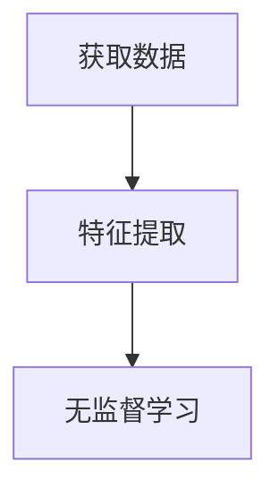

# Preface About machine-learning

## 1. Basic Information 

### 1.1 Definition

> 机器学习是一门多领域交叉学科，涉及概率论、统计学、逼近论、凸分析、算法复杂度理论等多门学科。机器学习是人工智能的核心，机器学习算法是一类从数据中自动分析、获得规律，并利用规律对未知数据进行预测的方法。

### 1.2 Classification

根据任务的不同可以分为

> 监督学习
>
> 非监督学习
>
> 半监督学习
>
> 增强学习（强化学习）

综述

> 监督学习的训练数据中包括类别信息，在监督学习中，典型的问题是分类和回归，典型的算法有Logistical Regression、BP神经网络训练和线性回归算法。
>
> 非监督学习中的训练数据集不包含任何类别信息。在无监督学习中，其典型问题是聚类问题，代表算法有K-Means算法、DBSCAN算法等。
>
> 半监督学习的训练数据中一部分数据带有类别信息，一部分不带类别信息，是监督学习和非监督学习的融合。在半监督学习中，其算法一般在监督学习的算法上拓展，使之可以在未标注数据建模。

### 1.3 Common Algorithm

> 朴素贝叶斯分类器算法
>
> K均值聚类算法
>
> 支持向量机算法
>
> Apriori算法
>
> 线性回归
>
> 逻辑回归
>
> 人工神经网络
>
> 随机森林
>
> 决策树
>
> 最近邻近算法
## 2. About Sklearn

[Document](https://scikit-learn.org/stable/index.html) 

Sklearn——Machine Learning in Python

> - Simple and efficient tools for predictive data analysis
> - Accessible to everybody, and reusable in various contexts
> - Built on NumPy, SciPy, and matplotlib
> - Open source, commercially usable - BSD license


# Chapter1 Learning Algorithm

## 1. Supervise Learning

> 在监督学习中，给定一组数据，输入数据和输出数据应该有一定的关系。同时，分类算法和回归算法是两类重要的算法，两者之间的主要区别是，分类算法中的标签是离散值，而回归算法中的标签是连续值。

### 1.1 Procedure

~~~mermaid
graph 
	subgraph ide1 [训练部分]
	A(获取数据) --> B[特征提取] --> C[监督学习] --> D(评价) --> C
	end
	subgraph 预测部分
	D --> E[模型] --> F[预测]
	end
~~~

### 1.2 Algorithm

> **分类问题**是指通过训练数据学习一个从观测样本到离散标签的映射，其是一个监督学习问题。典型问题有：
>
> > (1) 垃圾邮件的分类；
> >
> > (2) 点击率预测；
> >
> > (3) 手写字识别；
> 
>与分类问题不同的是，**回归问题**是指通过训练数据学习从一个观测样本到连续标签的映射。典型问题有：
> 
>> (1) 股票价格的预测；
> >
> > (2) 房屋价格的预测；

## 2. Unsupervise Learning

> 和分类、回归算法相比，无监督学习算法的主要特征是输入数据是未标注过的，即没有在给定的标签或分类，其在没有然后辅助的条件下学习数据结构。这带来了两点问题：
> ​	(1) 使我们可以处理大量数据，因为数据无需人工标注；
> ​	(2) 评估无监督学习算法的质量比较难，因为缺乏监督学习算法所用的明确的优秀测度。
> ​	无监督学习的常见任务之一是**降维**。一方面，降维可能有助于可视化数据(如t-SNE方法)；另一方面，降维可能有助于处理数据的多重共线性，为监督学习算法（如决策树）准备数据。

### 2.1 Procedure

具体流程图如下：



### 2.2 Algorithm

> **聚类算法**是无监督学习算法中最典型的一种算法。聚类算法利用样本的特征将具有相似特征的样本划分到同一个类别中，而不关心这个类别具体是什么。
> ​	除了聚类算法，在无监督学习中，还有一类重要的算法是**降维算法**，数据降维的基本原理是将数据点从输入空间通过线性或者非线性变换映射到一个低维空间，从而获得一个关于原始数据集的低维表示。

## Steps

1. 收集数据
2. 准备输入数据
3. 分析输入数据
4. 训练算法
5. 测试算法
6. 使用算法


# Chapter2 Linear Model

## Definition

> ​	回归，指研究一组随机变量(Y1 ，Y2 ，…，Yi)和另一组(X1，X2，…，Xk)变量之间关系的统计分析方法，又称多重回归分析。通常Y1，Y2，…，Yi是因变量，X1、X2，…，Xk是自变量。

## General Menthod

(1)收集数据：采用任意方法收集数据；

(2)准备输入数据：回归需要数值型数据，标称型数据将被转成二值型数据；

(3)分析输入数据：绘出数据的可视化图像；

(4)训练算法：找到回归系数；

(5)测试算法：找到R^2^或预测值和预测值和数据的拟合度，来分模型的效果；

(6)使用算法：使用回归模型预测一个数值。

## 1. Linear Regression

### 1.1 Synopsis

线性回归是利用数理统计中回归分析，来确定两种或两种以上变量间相互依赖的定量关系的一种统计分析方法，运用十分广泛。其表达形式为y = w'x+e，e为误差服从均值为0的正态分布。 
​	回归分析中，只包括一个自变量和一个因变量，且二者的关系可用一条直线近似表示，这种回归分析称为一元线性回归分析。如果回归分析中包括两个或两个以上的自变量，且因变量和自变量之间是线性关系，则称为多元线性回归分析。

### 1.2 Python code

Python实现主要有以下三个步骤：
(1) 训练得到w和b的向量:

```python

def train_wb(X,Y):
	'''
	:param X:N*D的数据
	:param Y:X对应的y值
	:return 返回(w, b)的向量
	'''
	if np.linalg.det(X.T*X) != 0:
		wb = ((X.T.dot(X).I).dot(X.T).dot(Y)
		return wb
```

(2) 获得数据的函数
```python
def getdata():
	x = []
	y = []
	file = open("ex0.txt","r")
	for line in file.readlines():
		temp = line.strip().split("\t")
		x.append([float(temp[0]),float(temp[1])])
		y.append(float(temp[2]))
	return (np.mat(x), np.mat(y).T)
```

(3)画图函数
```python
def draw(x, y, wb):
	a = np.linspace(0, np.max(x))
	b = wb[0] + a * wb[1]
	plot(x, y, '.')
	plot(a, b)
	show()
```
完整代码见文件 **Linear-regression.py**


## 2. Local Weighted Linear Regression

> 局部加权线性回归（LWLR）算法介绍线性回归的一个问题是，可能出现欠拟合，因此它求得最小均方差的无偏估计，可以引入一些偏差来降低均方误差。

### 2.1 Synopsis

> LWLR算法给预测点附近的每个点都赋予一定的权重，在这段区间上用基于最小均方误差来进行线性回归，使分区间局部线性回归得到全局拟合。

### 2.2 Python code

完整代码见文件 **LWLR.py** 


## 3. Generalized Linear Model

首先，广义线性模型是基于指数分布簇的。实际上，线性最小二乘法和Logistic回归都是广义线性模型中的一个特例，常见的分布有高斯分布、伯努利分布和泊松分布。

利用python进行基本的数据拟合，并对拟合结果的误差进行分析。
代码见文件 **GLM.py**

需要注意的是：

**(1) 误差分析**
	

做回归分析，常用的误差分析方法主要有均方误差根(RMSE)法和R-平方(R^2^)法。
	RMSE法是利用预测值和真实值的误差平方根的均值进行的。这种分析方法很流行，是一种定量的权衡方法。
	R2法是将预测值与只是用均值的情况进行了对比，看能好多少。其区间通常在(0,1)之间。0表示什么都不预测，直接取均值的情况；而1表示所有的预测值都跟真实值完美匹配的情况。

**(2) 过拟合**
	

使用100次方多项式做拟合，效果确实提高了一些，然而该模型的预测匹配能力却极其差，而且多项式系数出现了大量的大数值，甚至达到了10的12次方。
	去掉训练集中的最后两个样本，可以发现100次方多项式拟合结果发生了强烈的偏差，R2也急剧上升。
	这说明了高次多项式“过拟合”了训练数据，包括了大量噪音，导致其完全丧失了对数据的趋势的预测能力，因此，人们联想到了在拟合过程中限制系数值的大小来避免生成“畸形拟合函数”。
	其基本原理是将拟合多项式的所有系数绝对值之和(L1正则化)或平方和(L2正则化)加入惩罚模型中，并制定一个惩罚力度因子w,来避免产生这种畸形系数。这种思想应用在了岭回归、Lasso法、弹性网等方法中，都能有效避免“过拟合”，此时，模型系数参数变得很小，可能会稍微低于回归模型系数，这样的模型不仅误差更小且具备优秀的预测能力。
	

## 4. Logistic Regression Classifier

逻辑回归的主要思想是利用**最大似然概率**方法构造方程，为最大化方程，利用**牛顿梯度上升**求解方程参数。

> **优点**：计算不复杂，易于理解和实现
>
> **缺点**：容易欠拟合，分类精度可能不高
>
> **数据类型**：数值型和标称型数据


## 5. Neton Classifier

牛顿法是机器学习中使用得比较多的一种优化算法。牛顿法的基本思想是利用迭代点处的一阶导数和二阶导数对目标函数进行近似，然后把新的极小值点作为迭代点迭代，直到满足精度要求的近似极小值。牛顿法下降速度比梯度下降的快，并且能高度逼近最优值。牛顿法分为局部牛顿法和全局牛顿法。

牛顿法最突出的特点是收敛速度快，具有局部二阶收敛性。


## 6. Shrinkage Classifier

> 缩减法用于解决**特征数多于样本点数**的问题，常用方法有岭回归法、lasso回归和前向逐步线性回归法。

### RidgeRegres

简单来说，岭回归就是在原矩阵上加上一个 $ \lambda I $ ，从而使得矩阵非奇异。

岭回归最先用来处理特征数多于样本数的情况，现在也用于在估计中加入偏差，从而得到更好的估计。

另两个略


# Chapter3 Regression Tree

## 1. Synopsis

传统的线性回归算法用于拟合所有的数据，当数据量非常大及特征之间的关联非常复杂时，这个方法就不适用了。此时可以采用对数据进行切片的方式，再对切片后的局部数据进行线性回归，如果首次切片之后的数据不符合线性要求，则继续执行切片。在这过程中树结构和回归算法就非常有用。

我们经常采用决策树来处理分类问题，它一个重要特点在于，不需要了解机器学习的知识就能明白其原理。

决策树的一个重要任务是，为了理解数据所蕴含的知识信息，因此决策树可以使用不熟悉的数据集合，从而提取出一系列的规则，机器根据数据集创建规则的过程就是机器学习的过程。

> 决策树的特点：
>
> **优点**：计算复杂度不高，输出结果易于理解，对中间值的缺失不敏感，可以处理不相关特征的数据；
>
> **缺点**：可能产生过度匹配的情况；
>
> **适用数据类型**：数值型和标称型数据；

使用决策树的每一个步骤都很重要。决策树的构建分为一下三个步骤：

> 1. 特征选择；
> 2. 决策树的生成；
> 3. 决策树的修剪；

## 2. Feature Selection 

特征选择就是决定用哪个特征划分特征空间。

特征选择在于选取对训练数据具有分类能力的特征，这样可以提高决策树的学习效率，如果利用一个特征进行分类的结果与随机分类没有很大的区别，则称这个特征为没有分类能力的。通常选择特征的标准是信息增益(information gain)或者信息增益比。

信息增益：在划分数据集前后信息发生的变化。

### 2.1 香农熵

> 集合信息的度量方式称为香农熵或简称熵。

熵定义为信息的期待值。在信息论与概率统计中，熵表示随机变量的不确定性的度量。如果待分类的事务可能划分在多个分类中，则符号$ x_i$ 的信息可以定义为：
$$
 l(x_i) = - log_2p(x_i)
$$
式中，$ p(x_i) $ 为选择该分类的概率。

由此，我们可以通过编写python对特征的信息熵进行计算，同时，信息增益是相对于特征而言的，信息增益越大，特征对最终的分类结果影响也就越大，我们应该选择对最终分类结果影响最大的那个特征作为分类特征。

### 2.2 条件熵

> 条件熵 $H(Y|X)$ 表示在随机变量X的条件下Y的不确定性，定义X给定条件下Y的条件概率分布的熵对X的数学期望：
> $$
> H(Y|X) = \sum_{i=1}^n p_iH(Y|X)
> $$
> 其中 $p_i = P(X = x_i), i=1,2...,n $

## 3. Generate and Pruning

> 构建决策树的方法有很多，如C4.5、ID3和CART，这些算法在运行时并不总是在每次划分数据是都会消耗特征。决策树生成算法递归的生成决策树，知道不能产生决策树了为止，这样产生的决策树对分类数据的分类很精准，但是对未知的测试数据分类没那么精准，可能出现过拟合的现象，因此需要对生成的决策树进行简化修建。
>
> 通过降低决策树的复杂度来避免过拟合的过程称为剪枝。


## 4. Else

执行决策树进行分类以及通过matplotlib(或者Graphviz、plotly)对结果进行可视化呈现，并对生成好的决策树进行持久化存储(pickle.dump)。


## 5. Sklearn Instance

For detail elobration, browse [Offical Tutorial](https://scikit-learn.org/stable/modules/classes.html#module-sklearn.tree) .

### Generate

[sklearn.tree.DecisionTreeClassifier()](https://scikit-learn.org/stable/modules/generated/sklearn.tree.DecisionTreeClassifier.html#sklearn.tree.DecisionTreeClassifier)

> *class* `sklearn.tree.``DecisionTreeClassifier`(***, *criterion='gini'*, *splitter='best'*, *max_depth=None*, *min_samples_split=2*, *min_samples_leaf=1*, *min_weight_fraction_leaf=0.0*, *max_features=None*, *random_state=None*, *max_leaf_nodes=None*, *min_impurity_decrease=0.0*, *min_impurity_split=None*, *class_weight=None*, *ccp_alpha=0.0*)


## 6. CART

> CART(Classification and Regression Trees,  分类回归树)是十分著名的树构建算法，它使用二元切分法来处理连续变量，对其稍作修改即可处理回归问题。

### 6.1 Regression Tree

> 1. 构造树
>
> 	(1) 切分数据集并生成叶子节点；
>
> 	​	给定某个误差计算方法，chooseBestSplit()函数会找到数据集上最佳的二元切分方法。
>
> 	(2) 计算误差；
>
> 2. 剪枝
>
> 	(1) 预剪枝；
>
> 	​	chooseBestSplit()函数中的提前终止效果实际上是在进行一种所谓的预剪枝效果。
>
> 	(2) 后剪枝；
>
> 	​	使用后剪枝方法需要将数据集分成测试集和训练集。首先是指定参数，使得构建出的树足够大，足够复杂，便于剪枝。接下来从上而下找到叶子节点，用测试集来判断这些叶子节点合并是否能降低测试误差。如果是，则合并。


### 6.2 Model Tree

实现模型树主要有以下两个步骤：

> (1) 叶子节点；
>
> 用树来对数据建模，除把叶子节点简单地设定为常数值之外，还有一种方法是把叶子节点设定为分段线性函数。这里所谓的分段线性(piecewise linear)是指模型由多个线性片段组成。
>
> (2) 计算误差
>
> 前边用于回归树误差计算的方法这里不能再用了。稍加变化，对于给定的数据集，先用线性模型来对它进行拟合，然后计算真实的目标值与模型预测值之间的差值。最后将这些差值的平方求和就得到所需的误差。


# Chapter4 K-Means Clustering Algorithm

要理解K-means聚类算法，必须要先理解聚类和分类的区别。

分类是从特定的数据中挖掘模式，做出判断的过程。比如垃圾邮件的识别，每一个邮件都属于垃圾或非垃圾邮件，该只能将在人工识别几次后开始过滤垃圾邮件（半监督学习），在这个例子中，我们已经**人工预先划分**了两个类别，只需对任一邮件划分至两个类别中一个即可。

聚类的目的也是把数据分类，但是事先不知道如何区分（即**无预设分组**），完全由算法根据各个数据间的相似性进行分类。

## 1.  Synopsis

 K-means是一种非常常见的聚类算法，在处理聚类任务中经常使用。K-means是集简单与经典于一身的基于距离的聚类算法，采用聚类作为相似性指标，即认为两个对象的距离越近，则其相似度越高。

K-means聚类的核心思想是：通过迭代寻找k个类族的一种划分方案，使得用这k个类族的均值来代表相应各类样本时所得的总体误差最小。K个聚类有以下特点：各聚类本身尽可能紧凑，而各聚类之间尽可能分开。

K-means聚类算法的基础是最小误差平方和准则。K-means是基于相似性的无监督学习算法，通过比较样本之间的相似性，将较为相似的样本划分到同一个类别中。由于K-means聚类算法具有简单、易于实现等特点，其得到了广泛的应用，如在图像分割方面的应用。


## 2. Principle

### 2.1 Similarity Measure 

在K-means聚类算法中，通过两个对象的距离作为两个对象的相似性，为了度量两点的距离，一般定义一个距离函数d(X,Y)，利用d(X,Y)来表示样本X和样本Y之间的相似性，在机器学习中常用的距离函数有：

假设有点P和点Q，其对应的坐标分别为
$$
P = (x_1, x_2,...,x_n) \epsilon R^n
$$

$$
Q = (x_1, x_2,...,x_n) \epsilon R^n
$$

(1) 闵可夫斯基距离(Minkowski Distannce)
$$
d(P, Q) = ( \sum_{i=1}^n (x_i - y_i)^p)^{\frac{1}{p}}
$$
(2) 曼哈顿距离(Manhatten Distance)
$$
d(P, Q) = \sum_{i=1}^n |x_i - y_i|
$$
(3) 欧氏距离(Euclidean Distance)
$$
d(P, Q) =\sqrt{ \sum_{i=1}^n (x_i - y_i)^2}
$$


### 2.2 Step

> 1. 初始化k个距离中心；
> 2. 计算出每个对象与这k个中心的距离（相似性计算，这个下面会提到），假如x对象与y中心的距离最小（相似度最大），则x属于y中心。通过这一步就可以得到初步的k个聚类；
> 3. 再用第二步得到的每个聚类分别计算出新的聚类中心，和旧的聚类中心进行对比，假如不相同，则继续第二步，直到新、旧两个聚类中心相同，说明聚类不可变，已经成功。

### 2.3 Pros and Cons 

#### Merits:

> 1、原理简单（靠近中心点） ，实现容易
>
> 2、聚类效果中上（依赖K的选择）
>
> 3、空间复杂度o(N)时间复杂度o(IKN，N为样本点个数，K为中心点个数，I为迭代次数）

#### Defects:

> 1、对离群点， 噪声敏感 （中心点易偏移）
>
> 2、很难发现大小差别很大的簇及进行增量计算
>
> 3、结果不一定是全局最优，只能保证局部最优（与K的个数及初值选取有关）


## 3. K-Nearest Neighbor

### 3.1 Synopsis

> K-邻近 (K-Nearest Neighbor, KNN) 分类算法，是一个理论上比较不成熟的算法，也是简单的机器学习算法之一。该方法的思路是：如果一个样本在特征空间中的K个最相似样本中的大多数属于某一个类别，则这个样本也属于这个类别。
>
> K-邻近算法采用不同特征之间的距离方法进行分类，所以它是一个分类算法。K-邻近算法的优点是无数据输入假定，对异常不敏感。缺点为复杂度高。

### 3.2 Code

To be fill.


## 4. Assorted Clustering Algorithm 

### 4.1 Partition Methods

#### 4.2.1 Principle

给定一个有N个元组或者纪录的数据集，分裂法将构造K个分组，每一个分组就代表一个聚类，K《N。而且这K个分组满足下列条件：

（1） 每一个分组至少包含一个数据纪录；

（2）每一个数据纪录属于且仅属于一个分组（注意：这个要求在某些模糊聚类算法中可以放宽）；

对于给定的K，算法首先给出一个初始的分组方法，以后通过反复迭代的方法改变分组，使得每一次改进之后的分组方案都较前一次好，而所谓好的标准就是：同一分组中的记录越近越好，而不同分组中的纪录越远越好。

大部分划分方法是基于距离的。给定要构建的分区数k，划分方法首先创建一个初始化划分。然后，它采用一种迭代的重定位技术，通过把对象从一个组移动到另一个组来进行划分。一个好的划分的一般准备是：同一个簇中的对象尽可能相互接近或相关，而不同的簇中的对象尽可能远离或不同。还有许多评判划分质量的其他准则。传统的划分方法可以扩展到子空间聚类，而不是搜索整个数据空间。当存在很多属性并且数据稀疏时，这是有用的。为了达到全局最优，基于划分的聚类可能需要穷举所有可能的划分，计算量极大。实际上，大多数应用都采用了流行的启发式方法，如k-均值和k-中心算法，渐近的提高聚类质量，逼近局部最优解。这些启发式聚类方法很适合发现中小规模的数据库中小规模的数据库中的球状簇。为了发现具有复杂形状的簇和对超大型数据集进行聚类，需要进一步扩展基于划分的方法。

#### 4.2.2 Pros and Cons

> **Merits**：对于大型数据集也是简单高效、时间复杂度、空间复杂度低。
>
> **Defect**：最重要是数据集大时结果容易局部最优；需要预先设定K值，对最先的K个点选取很敏感；对噪声和离群值非常敏感；只用于numerical类型数据；不能解决非凸（non-convex）数据。

k-means对初始值的设置很敏感，所以有了k-means++、intelligent k-means、genetic k-means。
k-means对噪声和离群值非常敏感，所以有了k-medoids和k-medians。
k-means只用于numerical类型数据，不适用于categorical类型数据，所以k-modes。
k-means不能解决非凸（non-convex）数据，所以有了kernel k-means。
另外，很多教程都告诉我们Partition-based methods聚类多适用于中等体量的数据集，但我们也不知道“中等”到底有多“中”，所以不妨理解成，数据集越大，越有可能陷入局部最小。下图显示的就是面对非凸，k-means和kernel k-means的不同效果。

#### 4.2.3 Common Algorithm

> 1. k-means：是一种典型的划分聚类算法，它用一个聚类的中心来代表一个簇，即在迭代过程中选择的聚点不一定是聚类中的一个点，该算法只能处理数值型数据。
> 2. k-modes:K-Means：算法的扩展，采用简单匹配方法来度量分类型数据的相似度。
> 3. k-prototypes：结合了K-Means和K-Modes两种算法，能够处理混合型数据。
> 4. k-medoids：在迭代过程中选择簇中的某点作为聚点，PAM是典型的k-medoids算法。
> 5. CLARA:CLARA算法在PAM的基础上采用了抽样技术，能够处理大规模数据。
> 6. CLARANS:CLARANS算法融合了PAM和CLARA两者的优点，是第一个用于空间数据库的聚类算法。
> 7. Focused CLARAN：采用了空间索引技术提高了CLARANS算法的效率。
> 8. PCM：模糊集合理论引入聚类分析中并提出了PCM模糊聚类算法。


### 4.2 Hierarchical Methods

#### 4.2.1 Synopsis

> 层次聚类主要有两种类型：合并的层次聚类和分裂的层次聚类。前者是一种自底向上的层次聚类算法，从最底层开始，每一次通过合并最相似的聚类来形成上一层次中的聚类，整个当全部数据点都合并到一个聚类的时候停止或者达到某个终止条件而结束，大部分层次聚类都是采用这种方法处理。后者是采用自顶向下的方法，从一个包含全部数据点的聚类开始，然后把根节点分裂为一些子聚类，每个子聚类再递归地继续往下分裂，直到出现只包含一个数据点的单节点聚类出现，即每个聚类中仅包含一个数据点。

#### 4.2.2 Pros and Cons

> **Merits**：可解释性好（如当需要创建一种分类法时）；还有些研究表明这些算法能产生高质量的聚类，也会应用在上面说的先取K比较大的K-means后的合并阶段；还有对于K-means不能解决的非球形族就可以解决了。
>
> **Defect**：缺点：时间复杂度高o(m3)，改进后的算法也有o(m2lgm)，m为点的个数；贪心算法的缺点，一步错步步错；同K-means，difficulty handling different sized clusters and convex shapes。

### 4.3 Density-based Method

#### 4.3.1 Synopsis

基于密度的方法（density-based methods），基于密度的方法与其它方法的一个根本区别是：它不是基于各种各样的距离的，而是基于密度的。这样就能克服基于距离的算法只能发现“类圆形”的聚类的缺点。

这个方法的指导思想就是，只要一个区域中的点的密度大过某个阈值，就把它加到与之相近的聚类中去。k-means解决不了不规则形状的聚类。于是就有了Density-based methods来系统解决这个问题。该方法同时也对噪声数据的处理比较好。其原理简单说画圈儿，其中要定义两个参数，一个是圈儿的最大半径，一个是一个圈儿里最少应容纳几个点。只要邻近区域的密度（对象或数据点的数目）超过某个阈值，就继续聚类,最后在一个圈里的，就是一个类。	

DBSCAN（Density-Based Spatial Clustering of Applications with Noise）就是其中的典型，其可视化效果可以浏览一个很有趣的网站https://www.naftaliharris.com/blog/visualizing-dbscan-clustering.

#### 4.3.2 DBSCAN

##### Definition

> DBSCAN(Density-Based Spatial Clustering of Applications with Noise)是一个比较有代表性的基于密度的聚类算法。与划分和层次聚类方法不同，它将簇定义为密度相连的点的最大集合，能够把具有足够高密度的区域划分为簇，并可在噪声的空间数据库中发现任意形状的聚类。

##### Relevant definition

> **Ε邻域**：给定对象半径为Ε内的区域称为该对象的Ε邻域；
>
> **核心对象**：如果给定对象Ε邻域内的样本点数大于等于MinPts，则称该对象为核心对象；
>
> **直接密度可达**：对于样本集合D，如果样本点q在p的Ε邻域内，并且p为核心对象，那么对象q从对象p直接密度可达。
>
> **密度可达**：对于样本集合D，给定一串样本点p1,p2….pn，p= p1,q= pn,假如对象pi从pi-1直接密度可达，那么对象q从对象p密度可达。
>
> **密度相连**：存在样本集合D中的一点o，如果对象o到对象p和对象q都是密度可达的，那么p和q密度相联。

可以发现，密度可达是直接密度可达的传递闭包，并且这种关系是非对称的。密度相连是对称关系。DBSCAN目的是找到密度相连对象的最大集合。

Eg: 假设半径Ε=3，MinPts=3，点p的E邻域中有点{m,p,p1,p2,o}, 点m的E邻域中有点{m,q,p,m1,m2},点q的E邻域中有点{q,m},点o的E邻域中有点{o,p,s},点s的E邻域中有点{o,s,s1}.

那么核心对象有p,m,o,s(q不是核心对象，因为它对应的E邻域中点数量等于2，小于MinPts=3)；

点m从点p直接密度可达，因为m在p的E邻域内，并且p为核心对象；

点q从点p密度可达，因为点q从点m直接密度可达，并且点m从点p直接密度可达；

点q到点s密度相连，因为点q从点p密度可达，并且s从点p密度可达。

##### Procedure

> 1.将所有点标记为核心点、边界点或噪声点；
>
> 2.删除噪声点；
>
> 3.为距离在Eps之内的所有核心点之间赋予一条边；
>
> 4.每组连通的核心点形成一个簇；
>
> 5.将每个边界点指派到一个与之关联的核心点的簇中（哪一个核心点的半径范围之内）

##### Pro and cons

**Merit**

> - 与K-means方法之间相比，DBSCAN不需要事先知道要形成的簇类的数量；
> - 与K-means方法之间相比，DBSCAN可以发现任意形状的簇类；
> - DBSCAN可以发现噪音点；
> - DBSCAN对数据库中的样本顺序不敏感；

**Defect**

> - DBSCAN不能很好地反映尺寸数据；
> - DBSCAN不能很好地反映数据及变化的密度；
> - 对于高维数据，点之间极为稀疏，密度难以定义。


#### 4.3.3 Spectral Clustering

##### Synopsis

> 谱聚类算法建立在谱图理论基础上，与传统的聚类算法相比，它具有能在任意形状的样本空间上聚类且收敛于全局最优解的优点。
>
> 该算法首先根据给定的样本数据集定义一个描述成对数据点相似度的亲合矩阵,并且计算矩阵的特征值和特征向量 ， 然后选择合适 的特征向量聚类不同的数据点。谱聚类算法最初用于计算机视觉 、VLS I 设计等领域， 最近才开始用于机器学习中，并迅速成为国际上机器学习领域的研究热点。
>
> 谱聚类算法建立在图论中的谱图理论基础上，其本质是将聚类问题转化为图的最优划分问题，是一种点对聚类算法，对数据聚类具有很好的应用前景。


##### Prodecure

> 谱聚类算法将数据集中的每个对象看作是图的顶点V，将顶点间的相似度量化作为相应顶点连接边E的权值，这样就得到一个基于相似度的无向加权图G(V, E)，于是聚类问题就可以转化为图的划分问题。基于图论的最优划分准则就是使划分成的子图内部相似度最大，子图之间的相似度最小。
>
> 虽然根据不同的准则函数及谱映射方法，谱聚类算法有着不同的具体实现方法，但是这些实现方法都可以归纳为下面三个主要步骤：
>
> 1) 构建表示对象集的相似度矩阵W；
>
> 2) 通过计算相似度矩阵或拉普拉斯矩阵的前k个特征值与特征向量，构建特征向量空间；
>
> 3) 利用K-means或其它经典聚类算法对特征向量空间中的特征向量进行聚类。
>
> 上面的步骤只是谱聚类算法的一个总体框架，由于划分准则、相似度矩阵计算方法等因素的差别，具体的算法实现同样会有所差别，但其本质依然是图划分问题的连续放松形式。


#### 4.3.4 Birch Clustering

##### Synopsis

> BIRCH的全称是利用层次方法的平衡迭代规约和聚类（Balanced Iterative Reducing and Clustering  Using  Hierarchies），名字实在是太长了，不过没关系，其实只要明白它是用层次方法来聚类和规约数据就可以了。刚才提到了，BIRCH只需要单遍扫描数据集就能进行聚类，那它是怎么做到的呢？
>
> BIRCH算法利用了一个树结构来帮助我们快速的聚类，这个数结构类似于平衡B+树，一般将它称之为聚类特征树(Clustering  Feature Tree，简称CF Tree)。这颗树的每一个节点是由若干个聚类特征(Clustering  Feature，简称CF)组成。从下图我们可以看看聚类特征树是什么样子的：每个节点包括叶子节点都有若干个CF，而内部节点的CF有指向孩子节点的指针，所有的叶子节点用一个双向链表链接起来。

##### 聚类特征CF与聚类特征树CF Tree

在聚类特征树中，一个聚类特征CF是这样定义的：每一个CF是一个三元组，可以用（N，LS，SS）表示。其中N代表了这个CF中拥有的样本点的数量，这个好理解；LS代表了这个CF中拥有的样本点各特征维度的和向量，SS代表了这个CF中拥有的样本点各特征维度的平方和。举个例子如下图，在CF Tree中的某一个节点的某一个CF中，有下面5个样本(3,4), (2,6), (4,5), (4,7), (3,8)。则它对应的系数为：
$$
LS = (3+2+4+4+3, 4+6+5+7+8) = (16, 30), \\
SS = (3^2 + 2^2 + 4^2 + 3^2 + +4^2 + 6^2 + 5^2 + 7^2 + 8^2) = (54 + 190) = 244
$$


CF有一个很好的性质，就是满足线性关系，也就是 $ CF_1 + CF_2 = (N_1 + N_2, LS_1 + LS_2, SS_1+SS_2)$ 。

这个性质从定义也很好理解。如果把这个性质放在CF Tree上，也就是说，在CF Tree中，对于每个父节点中的CF节点，它的(N,LS,SS)三元组的值等于这个CF节点所指向的所有子节点的三元组之和。如下图所示：
 
   从上图中可以看出，根节点的CF1的三元组的值，可以从它指向的6个子节点（CF7 - CF12)的值相加得到。这样我们在更新CF Tree的时候，可以很高效。

对于CF  Tree，我们一般有几个重要参数，第一个参数是每个内部节点的最大CF数B，第二个参数是每个叶子节点的最大CF数L，第三个参数是针对叶子节点中某个CF中的样本点来说的，它是叶节点每个CF的最大样本半径阈值T，也就是说，在这个CF中的所有样本点一定要在半径小于T的一个超球体内。对于上图中的CF Tree，限定了B=7， L=5， 也就是说内部节点最多有7个CF，而叶子节点最多有5个CF。


#### 4.3.5 Gaussian Mixed Model

高斯混合模型（Gaussian Mixed  Model）指的是多个高斯分布函数的线性组合，理论上GMM可以拟合出任意类型的分布，通常用于解决同一集合下的数据包含多个不同的分布的情况（或者是同一类分布但参数不一样，或者是不同类型的分布，比如正态分布和伯努利分布）。

高斯混合模型可以看作是由 K 个单高斯模型组合而成的模型，这 K 个子模型是混合模型的隐变量（Hidden variable）。一般来说，一个混合模型可以使用任何概率分布，这里使用高斯混合模型是因为高斯分布具备很好的数学性质以及良好的计算性能。

举个不是特别稳妥的例子，比如我们现在有一组狗的样本数据，不同种类的狗，体型、颜色、长相各不相同，但都属于狗这个种类，此时单高斯模型可能不能很好的来描述这个分布，因为样本数据分布并不是一个单一的椭圆，所以用混合高斯分布可以更好的描述这个问题，如下图所示：


图中每个点都由 K 个子模型中的某一个生成。

首先定义如下信息：

- $ x_j$表示第 j 个观测数据，$j = 1,2,...,N$;
- $K$是混合模型中子高斯模型的数量，$K = 1,2,...,N$;
- $ \alpha_k $是观测数据属于第 $k$个子模型的概率，$ \alpha_k >0, \sum_{k=1}^K \alpha_k = 1$ ;
- $ \phi(x|\theta_k)$ 是第 $k$ 个子模型的高斯分布密度函数， $ \theta_k = (\mu_k, \sigma_k^2)$ , 其展开形式与上面介绍的单高斯模型相同;
- $\gamma_{jk}$ 表示第 $j$ 个观测数据属于第 $k$ 个子模型的概率;

高斯混合模型的概率分布为：

$ P(x | \theta) = \sum_{k=1}^K \alpha_k \phi(x|\theta_k)$ 

对于这个模型而言，参数 $ \theta = (\tilde\mu_k, \tilde\sigma_k, \tilde\alpha_k)$ ，也就是每个子模型的期望、方差（或协方差)、在混合模型中发生的概率。


#### 4.3.6 K-means++ Clustering Algorithm

##### Synopsis

> 由于K-means算法简单且易于实现，因此其得到了很多应用，但是K-means算法中聚类的中心个数k需要事先指定，这就给一些未知数据带来了很大的局限性。另外，在应用K-means算法进行聚类计算之前需要初始化k个聚类中心，在上述算法过程中，聚类中心的初始化是随机的，且其选择的好坏对算法结果有很大的影响，为了解决这些问题，K-means++算法被提出（还有其他两种改进方法）。

##### Prodecure

K-means++聚类算法中心初始化的基本原则是使得**初始的聚类中心之间的相互距离要尽可能的远**。

算法描述如下：

1. 随机选取一个样本作为第一个聚类中心；
2. 计算每个样本与当前已有类聚中心最短距离（即与最近一个聚类中心的距离），用 `D(x)`表示；这个值越大，表示被选取作为聚类中心的概率较大；最后，用轮盘法选出下一个聚类中心；
3. 重复步骤二，直到 k 个聚类中心都被确定为止。

选出初始点后，使用标准的 k-means 算法。


# Chapter5 Naive Bayes

> 朴素贝叶斯算法是有监督的学习算法，解决的问题是分类问题，如客户是否流失、是否值得投资、信用等级评定的多分类问题。该算法的优点在于简单易懂、学习效率高，在某些领域的分类问题中能够与决策树、神经网络相媲美，但由于该算法以自变量之间的独立性和连续变量的正态性假设为前提，可能导致算法精度在某种程度上受影响。

## 1. Bayes Theory

贝叶斯定义是概率论中的一个定理,它跟随机变量的条件概率以及边缘概率分布有关.

通常，事件A在事件B（发生）的条件下的概率，与事件B在事件A（发生）的条件下的概率是不一样的，然而,这两者之间是有确定的关系的，贝叶斯定理就是这种关系的陈述。贝叶斯公式的一个用途在于通过已知的三个概率函数推出第四个，公式表达为:
$$
P(A|B) = \frac{P(A|B) \cdot P(A)}{P(B)}
$$
其中,P(A|B)是指事件B发生的情况下事件A发生的概率(条件概率)。在贝叶斯定理中,每个名词都有约定俗成的名称:

> - P(A|B)是已知B发生后A的条件概率,也由于得知B的取值而被称作**A的后验概率**；
> - P(A)是A的先验概率(或边缘概率).之所以称为"先验"是因为它不考虑任何B方面的因素；
> - P(B|A)是已知A发生后B的条件概率,也由于得知A的取值而成称作**B的后验概率**；
> - P(B)是B的先验概率(或边缘概率)；
> - $ \frac{P(B|A)}{P(B)} $ 称为“可能性函数”，这是一个调整因子。

按这些术语,贝叶斯定理可以表述为:

> 后验概率 = (似然性 * 先验概率 )/ 标准化常量

也就是说,后验概率与先验概率和相似度的乘积成正比.

同时，分母P(B)，可以根据全概率公式分解为:
$$
P(B) = \sum_{i=1}^n P(Ai)\cdot P(B|Ai)
$$
**贝叶斯与朴素贝叶斯是不同的，区别在于“朴素”二字，即朴素贝叶斯对条件概率分布做了体偶案件独立性假设。**


## 2. Application

负面或侮辱性语言检测屏蔽。

将文本看成单词向量或词条向量，也就是说将句子转化为向量，再将其存储训练，具体代码待补充。


## 3. Pro and Cons

**Merit**

> - 生成式模型，通过计算概率来进行分类，可以用来处理多分类问题；
> - 对小规模数据表现很好，适合多分类任务及增量式训练，算法也比较简单。

**Defect**

> - 对输入数据的表达形式很敏感；
> - 朴素贝叶斯算法的“朴素”特点会带来一些准确率上的损失；
> - 需要计算先验概率，分类决策存在错误率。


# Chapter6 Data Dimensionality Reduction 

数据降维是机器学习领域中非常重要的内容。所谓降维就是指采用某种映射方法，将原高位空间中的数据点映射到低维空间中。降维的本质是学习一个函数 $ f:x \rightarrow y $ ，其中x是原始数据点的表达，目前多使用向量表达形式。y是数据点映射后的低维向量表达，通常y的维度小于x的维度。映射函数f可能是显式的或隐式的、线性的或非线性的。

目前大部分降维算法处理向量后表达的数据，也有一些降维算法处理高阶张量表达的数据。之所以使用降维后的数据表示是因为在原始的高维空间中，包括了冗余信息及噪音信息，在实际应用中如图像识别中造成了误差，降低了准确率；而通过降维，我们希望减小冗余信息所造成的误差，提高识别的精度，以及希望通过降维算法来寻找数据内部的本质结构特征。

## 1. Curse of Dimensionality

为了得到更精确的分类器，我们会不断新增更多的分类特征。通过将特征增加到好几百，我们能得到一个完美的分类器吗？回答可能会出乎你们的意料：不能！事实上，过了某个临界点，如果还持续的增加特征，那么分类器的性能会下降。正如下图，这就是我们经常说的“维度灾难curse of dimension”。


**一方面，使用太多的特征导致了过拟合。分类器学习了很多异常特征（如噪声等），因此对于新的数据泛化性能不好。**而实际上，通过增加第三维度来获得最优分类效果等价于在低维空间使用复杂的非线性分类器，而往往复杂的模型结构也是导致过拟合的原因之一。结果就是分类器学习到了很多数据集中的特例，因此对于现实数据往往会效果较差，因为现实数据是没有这些噪声以及异常特性的。
因此说，过拟合是维度灾难带来的最直接结果。

**另一方面，使用太多的特征，导致训练样本数量过大而无法满足，同时计算量过大。**如果特征维度成千上万，则需要的训练样本数量基本上不可能满足，并且高维的距离计算也比较麻烦。在高维情形下出现的数据样本稀疏、计算距离困难等问题造成的机器学习方法学习的严重障碍，此时我们可以采用降维来缓解这个问题。

## 2. Synopsis

进行数据降维主要基于以下目的：

- 压缩数据也减小存储量；
- 去除噪声的影响；
- 从数据中提取特征以分类；
- 将数据投影到低维可视空间，以便于看清数据的分布。

数据的降维方法可以分为**线性和非线性降维**，而非线性降维有分为基于核函数的方法和基于特征值的方法。

> 线性降维方法有**主成分分析(PCA)**、**独立成分分析(ICA)**、**局部特征分析(LFA)**等；
>
> 基于核函数的非线性降维方法有**基于核函数的主成分分析(KPCA)**、**基于核函数的独立成分分析(KICA)**和**基于核函数的决策分析(KDA)**等；
>
> 基于特征值的非线性降维方法有**等距映射算法(ISOMAP)**和**局部线性嵌入算法(LLE)**。

## 3. Principal Component Analysis

### 3.1 Synopsis

 Principal Component Analysis(PCA)是最常用的线性降维方法，它的目标是通过某种线性投影，将高维的数据映射到低维的空间中表示，并期望在所投影的维度上数据的方差最大，以此使用较少的数据维度，同时保留住较多的原数据点的特性。

 通俗的理解，如果把所有的点都映射到一起，那么几乎所有的信息（如点和点之间的距离关系）都丢失了，而如果映射后方差尽可能的大，那么数据点则会  分散开来，以此来保留更多的信息。可以证明，PCA是丢失原始数据信息最少的一种线性降维方式。（实际上就是最接近原始数据，但是PCA并不试图去探索数据内在结构）

### 3.2 Prodecure

> 1. 将原始数据按列组成 n 行 m 列矩阵 X；
> 2. 将 X 的每一行进行零均值化，即减去这一行的均值；
> 3. 求出协方差矩阵 $ C = \frac{1}{m}XX^T$ ；
> 4. 求出协方差矩阵的特征值及对应的特征向量；
> 5. 将特征向量按对应特征值大小从上到下按行排列成矩阵，取前 k 行组成矩阵 P；
> 6.  $ Y = PX$ 即为降维到 k 维后的数据。

具体求解过程：

设 n 维向量w为目标子空间的一个坐标轴方向（称为映射向量），最大化数据映射后的方差，有：
$$
max \frac{1}{m-1} \sum_{i=1}^m (W^T(X_i - \bar X))^2
$$
其中 m 是数据实例的个数， xi是数据实例 i 的向量表达， x拔是所有数据实例的平均向量。定义W为包含所有映射向量为列向量的矩阵，经过线性代数变换，可以得到如下优化目标函数：
$$
min tr(\bold W^T \bold {AW}), s.t. \bold{W^TW} = \bold I \\
\bold A = \frac{1}{m-1}\sum_{in-1}^m (x_i - \bar x)(x_i - \bar x)^T
$$
其中tr表示矩阵的迹， A是数据协方差矩阵。

容易得到最优的W是由数据协方差矩阵前 k 个最大的特征值对应的特征向量作为列向量构成的。这些特征向量形成一组正交基并且最好地保留了数据中的信息。

PCA的输出就是$Y = W'X$，由X的原始维度降低到了k维。

PCA追求的是在降维之后能够最大化保持数据的内在信息，并通过衡量在投影方向上的数据方差的大小来衡量该方向的重要性。但是这样投影以后对数据  的区分作用并不大，反而可能使得数据点揉杂在一起无法区分。这也是PCA存在的最大一个问题，这导致使用PCA在很多情况下的分类效果并不好。具体可以看  下图所示，若使用PCA将数据点投影至一维空间上时，PCA会选择2轴，这使得原本很容易区分的两簇点被揉杂在一起变得无法区分；而这时若选择1轴将会得 到很好的区分结果。

 

 Discriminant  Analysis所追求的目标与PCA不同，不是希望保持数据最多的信息，而是希望数据在降维后能够很容易地被区分开来。后面会介绍LDA的方法，是另一 种常见的线性降维方法。另外一些非线性的降维方法利用数据点的局部性质，也可以做到比较好地区分结果。

### 3.3 Two principle

> (1)最大重构性：样本集中的所有点重构后距离原来的点的误差之和最小；
>
> (2)最大可分性：样本点在低维空间的投影尽可能分开；


## 4. Kernel Function

核函数（kernel function）可以**直接得到**低维数据映射到高维后的内积，而忽略映射函数具体是什么，即
 **K(x, y) = <φ(x), φ(y)>**，其中x和y是低维的输入向量，φ是从低维到高维的映射，<x, y>是x和y的内积。

核函数是一个非常有趣和强大的工具。 它是强大的，因为它提供了一个从线性到非线性的连接以及任何可以只表示两个向量之间的点积的算法。如果我们首先将我们的输入数据映射到更高维的空间，那么我在这个高维的空间进行操作出的效果，在原来那个空间就表现为非线性。

核函数方法将逐步成为一种重要的方法，是将非线性问题线性化的一种普适方法。

核函数有很多限制要求，比如要求是连续的，对称的，等等。这里不做深入探讨，毕竟不是数学系的，不用深入研究（恩，其实是看不懂）。下面列举一些常用的核函数，至于怎么选择，恩，目前是世界性难题。


## 5. ISOMAP

### 5.1 Synopsis

希望在映射过程中保持流形上测地线的距离不变
测地距离

测地距离是沿流形上的两点最短距离，而欧式距离是两点最短的那个直线距离。如下图可见。


> Principle：构造邻接图，用图上的最短距离来近似测地距离

在流形结构未知的情况下，要根据有限的数据采样来估算流形上的测地距离。利用流形在局部上与欧式空间同胚这个性质，对每个点基于欧式距离找出其近邻点，然后就能建立一个近邻连接图。计算图中两点之间的最短距离，作为测地距离的近似值。计算邻接图中的距离，可以采用用Dijkstra或者Floyd算法。（一中不太准确理解，通过局部近邻点之间的距离，局部线性化，这些近邻点的距离之和即为测第距离）


### 5.2 Prodecure

1. 通过近邻点，计算近邻点的欧式距离；
2. 通过最短路径算法，得到距离矩阵；
3. 通过MDS（Multiple Dimension Scaling）使用 MDS 计算映射后的坐标 ?，使得映射坐标下的欧氏距离与原来的测地线距离尽量相等；

$$
\mathop{min}\limits_{y}\sum_{i,j}(d_M(x_i,y_i)-||y_i-y_j||)^2
$$

注：

Isomap得到的是训练样本在低维空间的坐标，对于新的样本，如何将其映射到低维空间呢？这个问题，是通过以训练样本的高维空间坐标维输入，低维空间坐标维输出，训练一个回归学习器来实现对新样本的低维空间坐标预测。

**Merit**

> 相比与LLE，isomap保持了更多的信息。

**Defect**

> Isomap 是一种全局方法，要考虑任意两点之间的关系，计算速度慢。随着数据点数量的增多而爆炸性增长，从而使得计算难以负荷。不适用与大数据。


## 6. Locally Linear Embedding

 局部线性嵌入(LLE)算法认为每一个数据点都可以由其近邻点的线性加权组合构造得到。算法的主要步骤分为三步：

> 1. 寻找每个样本点的k个近邻点；
> 	    
>
> 2. 由每个样本点的近邻点计算出该样本点的局部重建权值矩阵；
> 	    
>
> 3. 由该样本点的局部重建权值矩阵和其近邻点计算出该样本点的输出值。

具体的算法流程如图所示，描述LLE可以说是流形学习方法最经典的工作之一。


很多后续的流形学习、降维方法都与LLE有密切联系。

	


## 7. SVD

奇异值分解(SVD)，SVD奇异值分解等价于PCA主成分分析。核心都是求解 $ \bold {XX}^T$ 的特征值和对应的特征向量。


## 8. Manifold Learning

> 流形学习是个很广泛的概念。自从2000年以后，流形学习被认为属于非线性降维的一个分支。众所周知，引导这一领域迅速发展的是2000年Science杂志上的两篇文章:Isomap and LLE (Locally Linear Embedding)。

### 8.1 Synopsis

所谓流形（manifold）就是一般的几何对象的总称。流形就包括各种维数的曲线曲面等。和一般的降维分析一样，流形学习把一组在高维空间中的数据在低维空间中重新表示，不同的是，在流形学习中假设所处理的数据采样于一个潜在的流形上，或是说对于这组数据存在一个潜在的流形。对于不同的方法，对于流形性质的要求各不相同，这也就产生了在流形假设下的各种不同性质的假设。对于描述流形上的点，我们要用坐标，而流形上本身是没有坐标的，所以为了表示流形上的点，必须把流形放入外围空间（ambient  space）中，那末流形上的点就可以用外围空间的坐标来表示。比如R\^3中的球面是个2维的曲面，因为球面上只有两个自由度，但是球面上的点一般是用外围R\^3空间中的坐标表示的，所以我们看到的R\^3中球面上的点有3个数来表示的。当然球面还有柱坐标球坐标等表示。对于R\^3中的球面来说，那末流形学习可以粗略的概括为给出R\^3中的表示，在保持球面上点某些几何性质的条件下，找出找到一组对应的内蕴坐标（intrinsic  coordinate）表示，显然这个表示应该是两维的，因为球面的维数是两维的。这个过程也叫参数化（parameterization）。直观上来说，就是把这个球面尽量好的展开在通过原点的平面上。在PAMI中，这样的低维表示也叫内蕴特征（intrinsic feature）。一般外围空间的维数也叫观察维数，其表示也叫自然坐标（外围空间是欧式空间）表示,在统计中一般叫observation。

### 8.2 To be added


## 9. Multiple Dimensional Scaling

### 9.1 Synopsis

> 多维缩放（Mutiple Dimensional Scaling, MDS）是一种经典的降维方法，可以缓解在高维情形下出现的数据样本稀疏和距离计算困难等问题，即“维数灾难”。

### 9.2 Principle

原本样本的维数

| 样本 | 特征1 | 特征2 | 特征3 | 特征4 |
| ---- | ----- | ----- | ----- | ----- |
| A    | 1     | 0     | 2     | 3     |
| B    | 2     | 0     | 4     | 8     |
| C    | 4     | 0     | 5     | 9     |

距离矩阵

| 样本 | A    | B             | C              |
| ---- | ---- | ------------- | -------------- |
| A    | 0    | 2-1+4-2+8-3=8 | 4-1+5-2+7-3=10 |
| B    | 8    | 0             | 4-2+5-4+9-8=4  |
| C    | 10   | 4             | 0              |

经过多维缩放（MDS）之后特征（直观示例）

| 样本 | 特征1 | 特征3 | 特征4 |
| ---- | ----- | ----- | ----- |
| A    | 1     | 2     | 3     |
| B    | 2     | 4     | 8     |
| C    | 4     | 5     | 9     |

降维后的距离矩阵

| 样本 | A    | B             | C              |
| ---- | ---- | ------------- | -------------- |
| A    | 0    | 2-1+4-2+8-3=8 | 4-1+5-2+7-3=10 |
| B    | 8    | 0             | 4-2+5-4+9-8=4  |
| C    | 10   | 4             | 0              |

降维后仍然使距离矩阵不变


# Chapter7 Support Vector Machine

> 支持向量机(SVM)是一种监督式学习方法，可广泛地应用于统计分类和回归分析。它是由Corinna Cortes和Vapnik于1995年提出的，其在解决小样本、非线性及高维模式的识别中表现出许多特有的优势。这种分类器的特点是他们能够最小化经验误差和最大化集合边缘区，因此支持向量机也被称为最大边缘区分类器。

## 1. Synopsis

所谓支持向量机是之那些在间隔区边缘的训练样本点。这里的“机（机器）”实际上是一个算法，在机器学习领域，常把一些算法称为一个机器。

支持向量机与神经网络相似，都是学习型的机制，但与神经网络不同的是，SVM使用的是数学算法和优化技术。

SVM的关键在于核函数。低维空间向量机通常难以区分，解决的办法是把他们映射到高维空间去，但也会带来复杂度的增加。

## 2. Pros and Cons

支持向量机本质上是非线性方法，在样本量比较少的时候，容易抓住数据和特征之间的非线性关系，因此可以解决非线性问题，可以避免神经网络结构选择和局部极小点问题，从而提高泛化性能机解决高维问题。

SVM对缺失数据影响敏感，对非线性问题没有通用的解决方案，必须慎重选择核函数来处理，计算复杂度高。


# Chapter8 Random Forest

## 1. Synopsis

> 随机森林(Random Forest, RF)几乎是任何预测问题的固有选择，它是一个相对较新的机器学习策略，并且几乎可以用于任何方面，它属于机器学习算法的一大类——集成学习算法。集成学习算法在后边进行详细的说明。

随机森林算法是一种重要的基于 Baggong的集成算法，由一系列决策树组成，他通过自助法 (Bootstrap)重采样技术，从原始训练样本集中有放回地重复随机抽取m个样本，生成新的训练样本集合，然后根据自助样本集生成k个分类树组成随机森林，新数据的分类结果按分类树的投票多少而定。其实质是对决策树算法的一中改造，将多棵决策树合并在一起，每棵树的建立伊蓝宇一个独立抽取的样品，森里中的每棵树具有相同的分布，分类误差取决于每棵树的分类能力和他们之间的相关性。特征选择采用随机的方法分裂每一个节点，然后比较不同情况下产生的误差。能够检测到的内在估计误差、分类能力和相关性决定选择特征的数码。单棵树的分类能力可能很小，但在随即产生的大量的决策树后，一个测试样品可以统计每一棵树的分类结果，从而选择最可能的分类。

## 学习算法

根据下列算法而建造每棵树 [1] ：

1. 用*N*来表示训练用例（样本）的个数，*M*表示特征数目。
2. 输入特征数目*m*，用于确定决策树上一个节点的决策结果；其中*m*应远小于*M*。
3. 从*N*个训练用例（样本）中以有放回抽样的方式，取样*N*次，形成一个训练集（即bootstrap取样），并用未抽到的用例（样本）作预测，评估其误差。
4. 对于每一个节点，随机选择*m*个特征，决策树上每个节点的决定都是基于这些特征确定的。根据这m个特征，计算其最佳的分裂方式。
5. 每棵树都会完整成长而不会剪枝，这有可能在建完一棵正常树状分类器后会被采用）。


## 优点

随机森林的优点：

1）对于很多种资料，它可以产生高准确度的分类器；

2）它可以处理大量的输入变数；

3）它可以在决定类别时，评估变数的重要性；

4）在建造森林时，它可以在内部对于一般化后的误差产生不偏差的估计；

5）它包含一个好方法可以估计遗失的资料，并且，如果有很大一部分的资料遗失，仍可以维持准确度；

6）它提供一个实验方法，可以去侦测variable interactions；

7）对于不平衡的分类资料集来说，它可以平衡误差；

8）它计算各例中的亲近度，对于数据挖掘、侦测离群点（outlier）和将资料视觉化非常有用；

9）使用上述。它可被延伸应用在未标记的资料上，这类资料通常是使用非监督式聚类。也可侦测偏离者和观看资料；

10）学习过程是很快速的。


## 相关概念

> 1. **分裂**：在决策树的训练过程中，需要一次次的将训练数据集分裂成两个子数据集，这个过程就叫做分裂。
> 2. **特征**：在分类问题中，输入到分类器中的数据叫做特征。以上面的股票涨跌预测问题为例，特征就是前一天的交易量和收盘价。
> 3. **待选特征**：在决策树的构建过程中，需要按照一定的次序从全部的特征中选取特征。待选特征就是在步骤之前还没有被选择的特征的集合。例如，全部的特征是 ABCDE，第一步的时候，待选特征就是ABCDE，第一步选择了C，那么第二步的时候，待选特征就是ABDE。
> 4. **分裂特征**：接待选特征的定义，每一次选取的特征就是分裂特征，例如，在上面的例子中，第一步的分裂特征就是C。因为选出的这些特征将数据集分成了一个个不相交的部分，所以叫它们分裂特征。


# Chapter9 Nerual Network

> 受生物学的启发，人工神经网络由一系列简单的单元相互紧密联系构成，每个单元有一定数量的实数输入和唯一的实数输出。神经网络一个重要的用途就是接受和处理传感器产生的复杂的输入并进行自适应学习。人工神经网络算法模拟生物神经网络，是一种模式匹配算法，通常用于解决分类和回归问题中。
>
> 人工神经网络是机器学习的一个庞大分支，有几百种不同的算法；常见的人工神经网络包括感知机神经网络、BP神经网络、Hopfiled网络、自组织映射（SOM）网络、学习矢量量化（LVQ）网络等。

## 1. 感知机模型

> 感知机是一种线性模型，用于二分类问题。感知机将每一种实例分类为分类为正类（取值为+1）和负类（取值为-1）。感知机的物理意义：将输入空间（特征空间）划分为正、负两类的分离超平面。

### 1.1 Definition

> 感知机是一个有监督的学习算法；
>
> 感知机是二分类的线性模型，其输入是实例的特征向量，输出的是事例的类别，分别是+1和-1，属于判别模型。
>
> 假设训练数据集是线性可分的，感知机学习的目标是求得一个能够将训练数据集正实例点和负实例点完全正确分开的分离超平面。如果是非线性可分的数据，则最后无法获得超平面。

### 1.2 Learning Strategy

有了模型之后我们就需要确定模型的参数；模型的参数就是w和b，权重和参数b，这个bais这个偏置参数b。我们希望找到一个好的w和b，来得到那个确定好的分类的超平面，能够把所有的样本进行非常好的划分。

做法：实际上学习的策略就是要为我们的感知机模型或者任意一个模型来定义一个损失函数（损失函数就是我们来衡量一下当前这个模型他的性能来说对于我们已知的样本他分类的准不准。有一个训练数据，他在训练数据上有多少是对的，有多少是错的，那些他犯错的地方就是他带来损失的地方），怎么衡量一个模型在数据上的损失呢？有两种选择：其一是误分类点的数目。其二是误分类点到超平面的总距离。

||w||就是$ \left \| w \right \|=\sqrt{\left (w_{1} \right )^{2}+\left (w_{2} \right )^{2}+\cdots +\left (w_{n} \right )^{2}}$，对于所有的误分类点，如果把绝对值给他去掉的话由$|w\cdot x_{i}+b|$变成$$(w\cdot x_{i}+b)$$这个部分实际上就会有可能有正有负，这就是他的预测结果他的符号，$$y_{i}$$是他实际的一个真实的类别，对于这个$$x_{i}$$来说如果他是一个误分类点，那么我得到的结果假如是 $(w\cdot x_{i}+b)=-2$（函数值最后要经过sign函数符号变换才会成为+1或者-1），但是他真实的标签$$y_{i}=+1$$，所以前边再加上一个负号，这三者相乘的话他就会变成大于0，也就是说我通过这种方式就可以找到某一个点$$\left ( x_{i},y_{i} \right )$$与我们现在的wb模型来进行计算在这个等式情况下他满足大于0，那么就说明这个点被分类是错误的，也就是说我实际上预测的这个值的符号和他真实的类别的符号是不一致的，那么他就是负的。我们的目标是希望这些误分类点越少越好，当我所有的点都分类正确的时候，这些误分类点他就没有了，总距离就趋近于0了（最理想情况下就是0）。所以这个总的距离实际上就表明了我的当前的他的模型这个效果，在训练集上的效果如何。通过这样总的距离来间接地得到损失函数，表明我当前的这个模型在当前的w和b 的情况下是好还是不好。怎么样是最好呢？我希望找到一个w和b，使得这个总距离是最小的。这样我就找到了一个能够把所有的正例和负例都分开的这样的一个超平面了，因为w和b就确定了这样的一个超平面。

感知机的学习问题就转化为如何使的这个函数最小化。因为 $$\frac{1}{\left \| w \right \|}$$ 这个对求极值是没有影响的。在他最小化时候的那个w和b就是我们的模型最终学习到的结果。

对函数的极值进行求解的时候，最基本的算法叫做梯度下降法。所有的梯度下降法第一步都要初始化。所谓初始化就是把里边未知的参数我要给他赋一个值。对于这里随机的对w和b进行初始化实际上就是随机的选择了一个超平面。

### 1.3 Learning Algorithm

> 感知机学习算法是对上述损失函数进行极小化，求得$$w$$和$$b$$。但是用普通的基于所有样本的梯度和的均值的批量梯度下降法（BGD）是行不通的，原因在于我们的损失函数里面有限定，**只有误分类的M集合里面的样本才能参与损失函数的优化**。所以我们不能用最普通的批量梯度下降,只能采用**随机梯度下降（SGD）**。目标函数如下：
>
> $$L(w,b)=arg\min\limits_{w,b}(-\sum\limits_{{x_i}\in M}{y_i(w\cdot x_i+b)})$$

### 1.4 原始形式算法

输入：训练数据集$$ T={(x_1,y_1),(x_2,y_2),...,(x_N,y_N)}，y_i\in{\{-1,+1\}} $$ ，学习率$$η(0<η<1)$$

输出：$$w,b$$；感知机模型$$f(x)=sign(w\cdot {x}+b)$$

> 1. 赋初值 $$w_0,b_0$$ 
> 2.  选取数据点$$(x_i,y_i)$$
> 3. 判断该数据点是否为当前模型的误分类点，即判断若$$y_i(w\cdot {x_i}+b)<=0$$则更新
>
> $$
> w={w+\eta{y_ix_i}}\\
> b={b+\eta{y_i}}
> $$
>
> 4. 转到2，直到训练集中没有误分类点

通常，解出的超平面方程不止一个，因此，为了得到唯一的超平面方程，需要对分离超平面增加约束条件，这就是支持向量机的想法。

### 1.5 对偶形式算法

由于$$w,b$$的梯度更新公式：

$$
w  = w + \eta y_ix_i \\
b = b + \eta y_i
$$
我们的$$w,b$$经过了n次修改后的，参数可以变化为下公式，其中 $$α=ny$$ :

$$
w=\sum_{x_i\in{M}}\eta{y_ix_i}=\sum_{i=1}^n\alpha_iy_ix_i \\
b=\sum_{x_i\in{M}}\eta{y_i}=\sum_{i=1}^n\alpha_iy_i
$$
这样我们就得出了感知机的对偶算法。

输入：训练数据集$$T={(x_1,y_1),(x_2,y_2),...,(x_N,y_N)}$$，$$y_i\in{\{-1,+1\}}$$，学习率$$\eta(0<\eta<1)$$

输出：$$\alpha,b$$；感知机模型$$f(x)=sign(\sum_{j=1}^n\alpha_jy_jx_j\cdot {x}+b)$$，其中$$\alpha=(\alpha_1,\alpha_2,...,\alpha_n)^T$$

> 1. 赋初值$$\alpha_0,b_0$$
> 2. 选取数据点$$(x_i,y_i)$$
> 3. 判断该数据点是否为当前模型的误分类点，即判断若$$y_i(\sum_{j=1}^n\alpha_jy_jx_j\cdot {x_i}+b)<=0$$，则更新
>
> $$
> \alpha_i=\alpha_i+\eta \\
> b=b+\eta y_i
> $$
>
> 4. 转到2，直到训练集中没有误分类点

为了减少计算量，我们可以预先计算式中的内积，得到Gram矩阵

$$
G=[x_i,x_j]_{N×N}
$$

### 1.6 Conclusion

- 在向量维数（特征数）过高时，计算内积非常耗时，应选择对偶形式算法加速；
- 在向量个数（样本数）过多时，每次计算累计和就没有必要，应选择原始算法。

> 感知机算法是一个简单易懂的算法，自己编程实现也不太难。前面提到它是很多算法的鼻祖，比如**支持向量机算法，神经网络与深度学习**。因此虽然它现在已经不是一个在实践中广泛运用的算法，还是值得好好的去研究一下。感知机算法对偶形式为什么在实际运用中比原始形式快，也值得好好去体会。


## 2. 从感知机到神经网络

神经网络中最基本的成分是神经元。神经元的模型描述如下：

> + 每个神经元与其他神经元相连；
> + 当一个“神经元”兴奋时，它会向相邻的神经元发送化学物质，这样会改变相邻神经元内部的电位；
> + 如果某个神经元的电位超过一个“阈值”，则该神经元会被激活；

这样的神经元模型就是典型的**“M-P神经元模型”**。在这个模型中：

> + 每个神经元接受到来自相邻神经元传递过来的输入信号；
> + 这些输入信号通过带权重的连接进行传递；
> + 神经元接受到的总输入值将与神经元的阈值进行比较，然后通过“激活函数”处理以产生神经元输出；
> + 理论上的激活函数为跃阶函数，即$$ f(x) = \begin{cases} 1\quad(x\geq0)\\ 0\quad (x<0)\end{cases}$$ 

其模型如下图，其中：

> + $$ x_i(i=1,2,..,n$$ 为来自第$i$个相邻神经元的输入；
> + $$ w_i(i=1,2,..,n$$ 为第$i$个相邻神经元的连接权重；
>
> + $ \theta $ 为当前神经元的阈值；
> + $ y=f\begin{pmatrix} \sum\limits_{i=1}^nw_ix_i-\theta \end{pmatrix} $ 为当前神经元的输出，$ f $为激活函数；


**Note**

> + 感知机可以看作是神经网络的特例，感知机由两层神经元组成：输入层接收外界输入信号，输出层是M-P 神经元；
> + 感知机只有输入层神经元进行激活函数处理，即只拥有一层功能神经元，而输入层神经元并不进行激活函数处理；
> + 感知机的激活函数为$$ f(x) = \begin{cases} 1\quad(x\geq0)\\ -1\quad (x<0)\end{cases}$$ ；

## 3. 多层前馈神经网络

多层前馈神经网络是由输入层，若干个隐藏层和输出层组成的全连接网络，不存在环或回路。。每一层都由多个神经元组成，神经元和输入向量全连接，但是神经元和神经元之间没有连接，也不存在跨层连接。每一层的输出结果会作为下一层的输入向量，比如hidden layer1的输出向量为hidden layer2的输入向量。输入层不会对数据进行处理，只是代表整个神经网络最开始的输入向量，也就是样本的特征向量。神经网络的输入为向量，最后的输出也是向量。输出向量的维度取决于输出层神经元的个数。


多层前馈神经网络可以看作是非线性复合函数，它的学习过程就是将输入沿着网络结构的方向一层，一层的正向传播直到输出层，然后再通过反向传播算法 (BP) 对权重和偏置项进行跟更新。然后循环整个过程，直到满足最大迭代次数或者在验证集上的错误率变化不大。

当问题是回归问题时，损失函数为均方误差:

$$L(y,\widehat y)=\frac{1}{2}\sum\limits_i^n(\widehat{y_i}-y_i)^2 $$

当问题是分类问题时，损失函数多为交叉熵，最后一层的激活函数为softmax函数:

$$
\widehat{y}=softmax(z), z为上一层神经元的输出 \\
L(y,\widehat y) = -y^Tlog \widehat y
$$

### 1. BP网络算法

多层前馈神经网络的学习通常采用**误差传播算法（Error BackPropgation, BP）**，该算法是训练多层神经网络的经典算法。

#### 1.1 BP神经网络原理

BP(Back Propagation)神经网络的学习过程由信号的正向传播与误差的反向传播两个过程组成。正向传播时，输入样本从输入层传入，经隐层逐层处理后，传向输出层。若输出层的实际输出与期望输出不符，则转向误差的反向传播阶段。误差的反向传播是将输出误差以某种形式通过隐层向输入层逐层反传，并将误差分摊给各层的所有单元，从而获得各层单元的误差信号，此误差信号即作为修正各单元权值的依据。BP网络由输入层﹑输出层和隐层组成， $N_1$ 为输入层，$N_m $ 为输出层，其余为隐层。BP 神经网络的结构如下：


这里介绍三层神经网络的推导（一个输入层、一个隐层和一个输出层)

BP 神经网络反向传播算法的神经元示意图图一：


上图描绘了神经元 $j$ 被它左边的一层神经元产生的一组函数信号所馈给。 m m m是作用于神经元 $j$ 的所有输入不包括偏置的个数。突触权值 $w_{j0}(n)$ 等于神经元 $j$ 的偏置 $b_j$ 。

1.前向传播过程推导

图一中，在神经元 $j$ 的激活函数输入处产生的诱导局部域 $v_j(n)$ （即神经元 $j$ 的输入）是：


$\phi_j$ 是激活函数，则出现在神经元 $j$ 输出处的函数信号（即神经元 $j$ 的输出） $ y_j(n) $ 是：


2.误差反向传播过程推导

在图一中，$ y_j(n)$与  $d_j(n)$ 分别是神经元 $j$ 的实际输出和期望输出，则神经元 $j$ 的输出所产生的误差信号定义为：


其中， $d_j(n)$是期望响应向量 $d(n)$ 的第 $j$ 个元素。

为了使函数连续可导，这里最小化均方根差，定义神经元 $j$ 的瞬时误差能量为：


将所有输出层神经元的误差能量相加，得到整个网络的全部瞬时误差能量：


其中，集合C包括输出层的所有神经元。

BP 算法通过反复修正权值使式(2-5)  $E_n$ 最小化，采用梯度下降法对突触权值  $w_{ji}(n) $应用一个修正值 $∆w_{ji}(n)$ 它正比于偏导数 $δE(n)/\delta  w_{ji}(n)$ 。根据微分链式规则，把这个梯度表示为：


偏导数 $ δE(n)/\delta  w_{ji}(n)$ 代表一个敏感因子，决定突触权值 $w_{ji}$ 在权值空间的搜索方向。

在式(2-5)两边对 $e_j(n)$ 取微分，得到：


在式(2-3)两边对  $ y_j(n) $ 取微分，得到：

在式(2-2)两边对 $ v_j(n) $ 取微分，得到：

最后在式(2-1)两边对  $ w_{ji}(n) $ 取微分，得到：


将式(2-7)——(2-10)带入式(2-6)得：


应用于  $ w_{ji}(n) $ 的修正 $ ∆w_{ji}(n)  $ 定义为：


其中，  $ \eta $ 是误差反向传播的学习率， 负号表示在权空间中梯度下降。

将式(2-11)带入式(2-12)得：


其中，  $ \delta_j(n)  $ 是根据delta法则定义的局部梯度：


局部梯度指明了突触权值所需要的变化。

现在来考虑神经元 $j$ 所处的层。

（1） 神经元 $j$ 是输出层节点
当神经元 $j$ 位于输出层时，给它提供了一个期望响应。根据式(2-3)误差信号 $e_j(n)=d_j(n)-y_j(n)$确定，通过式(2-14)得到神经元 $j$ 的局部梯度  $ \delta_j(n)  $ 为：


（2） 神经元 $j$ 是隐层节点
当神经元 $j$ 位于隐层时，没有对该输入神经元的指定期望响应。隐层的误差信号要根据所有与隐层神经元直接相连的神经元的误差信号向后递归决定。
考虑神经元 $j$ 为隐层节点，隐层神经元的局部梯度  $ \delta_j(n)  $ 根据式(2-14)重新定义为：


来看图二：它表示输出层神经元 $ k  $ 连接到隐层神经元 $j$ 的信号流图。

在这里下标 $j$ 表示隐层神经元，下标 $ k  $ 表示输出层神经元。

图二中，网络的全部瞬时误差能量为：

在式(2-17)两边对函数信号  $y_j(n)$ 求偏导，得到：

在图二中：


因此，


图二中，对于输出层神经元 $ k  $  ，其诱导局部域是：


求式(2-21)对  $y_j(n)$ 的微分得到：


将式(2-20)和(2-22)带入到式(2-18)得到：


将式(2-23)带入式(2-16)得隐层神经元 $j$ 的局部梯度 $\delta_j(n) $ 为：


**反向传播过程推导总结**

因此，结合式(2-13)、(2-15)和(2-24)，由神经元 i i i连接到神经元 $j$ 的突触权值的修正值 $∆w_{ji}(n) $ ，按照delta法则定义如下：


其中：

> + 神经元 $j$ 是输出层节点时，局部梯度 $\delta_j(n)$ 等于倒数 $ \phi_j'(v_j(n)) $ 和误差信号 $ e_j(n)=d_j(n)-y_j(n) $的乘积，见式(2-15);
> + 神经元 $j$ 是隐层节点时，局部梯度 $\delta_j(n)$ 等于倒数 $ \phi_j'(v_j(n)) $ 和下一层（隐层或输出层）的 $ \delta_k $ 与权值加权和的乘积，见式(2-24)。

#### 1.2 标准BP神经网络设计原则

##### （1）激活函数

单极性S型函数和双曲正切S型函数

##### （2）学习率

$ 0 <\eta <1 $

##### （3）停止准则

网络的均方误差足够小或者训练足够的次数等

##### （4）初始权值

以均值等于0的均匀分布随机挑选突触权值

##### （5）隐层结构

理论证明一个隐层就能映射所有连续函数 ；
$$
隐藏层节点数 = \sqrt{(输入节点数+输出节点数)} + \alpha ，1<\alpha<10 \\
隐藏层节点数 = \sqrt{(输入节点数*输出节点数)} 
$$


#### 1.3 标准BP算法训练过程及流程图

##### （1）训练过程

> 1. 初始化网络的突触权值和阈值矩阵；
> 2. 训练样本的呈现；
> 3. 前向传播计算；
> 4. 误差反向传播计算并更新权值；
> 5. 迭代，用新的样本进行步骤3和4，直至满足停止准则。

##### （2）流程图


#### 1.4 标准BP算法分析

由于标准 BP 算法采用的是梯度下降法，BP 算法的 E-w 曲线图如下：


因此标准 BP 算法具有以下缺陷：

> 1. 在误差曲面上有些区域平坦，此时误差对权值的变化不敏感，误差下降缓慢，调整时间长，影响收敛速度。
> 2. 存在多个极小点，梯度下降法容易陷入极小点而无法得到全局最优解。
> 3. 学习率 $\eta$ 越小，学习速度减慢，而 $\eta$ 越大，虽然学习速度加快，却容易使权值的变化量不稳定，出现振荡。

#### 1.5 标准BP算法改进方法

##### （1）增加动量项

一个既要加快学习速度又要保持稳定的方法是修改式(2-13)，增加动量项，表示为：
$$
∆w_{ji}(n) =  \alpha∆w_{ji}(n-1) + \eta\delta_j(n)y_i(n)
$$
这里  $\alpha$ 是动量常数，$0≤\alpha<1$。

动量项$$ \alpha∆w_{ji}(n-1)$$反映了以前积累的调整经验，当误差梯度出现局部极小时，虽然 $∆w_{ji}(n)→0$，但$$ ∆w_{ji}(n-1) ≠0 $$，使其跳出局部极小区域，加快迭代收敛速度。

##### （2）其他改进方法

> + 可变学习速度的反向传播
> 	    
> + 学习速率的自适应调节
> 	    
> + 引入陡度因子——防止饱和
> 	    
> + 共轭梯度法、拟牛顿法等

---

# Chapter10 Data Preprocessing

在工程实践中，我们获取的数据因为各种各样的原因，如数据有缺失、数据有重复值等，都需要进行实验预处理。数据处理没有标准流程，通常会因为任务的不同、数据集属性的不同二有所不同。这个给出数据预处理的常用流程：

> + 去除唯一属性；
> + 处理缺失值；
> + 属性编码；
> + 数据标准化、正则化；
> + 特征选择；
> + 主成分分析；

## 1. Desription

> 数据的质量参数，包括准确性、完整性、一致性可信性和可解释性。

不完整、不正确和不一致的数据是现实世界大型数据库和数据仓库的共同特点。

## 2. Main task

> 数据预处理的主要任务为数据清理、数据集成、数据规约和数据变换。

### 数据清理

数据清理例程**填写缺失的值**，**光滑噪声数据**，**识别或删除离群点**，并**解决不一致**来解决"清理数据"。

### 数据集成

数据集成涉及多个数据库、数据立方体或文件。代表同一概念的属性在不同的数据库可能有不同的名字，这又导致了不一致性和冗余。因此，除数据清理外，必须采取步骤，避免数据集成时的冗余。通常，在为数据仓库准备数据的时候，数据处理和集成将作为预处理步骤进行，还有可以进行再次数据清理，检测和删去可能由于集成导致的冗余。

### 数据规约

数据归约得到数据集的简化表示，器小得多，但能够产生同样的（或者几乎同样的）分析效果。数据规约包括维规约和数值规约。

在维规约中，使用数据编码方案，以便得到原始数据的简化或“压缩”表示。相关离子包括数据压缩技术，以及属性子集选择和属性构造。

在数值规约中，使用参数模型或非参数模型，用较小的表带取代数据。

### 数据变换

许多基于距离的挖掘算法进行分析，如果待分析数据已经规范化，即按比例映射到一个较小的区域。

规范化、数据离散化和概念分层产生都是按着某种形式的数据变换。数据变换操作时引导挖掘过程成功的附加预处理过程。

> 其中，上面的四种分类也并不是相互独立，排斥的。

## 3. 去除唯一属性

获取的数据集中，经常会遇到一些唯一属性。这些属性通常是添加到一些ID属性，如存放在数据库中自增的主键。这些属性并不能刻画样本自身的分布规律，所以只需要简单地删除这些数据即可。

## 4. 处理缺失值

数据缺失值产生的原因多种多样，主要分为客观原因和主观原因两种。客观原因式由数据储存的失败、存储器损坏、机器故障等导致某段时间的数据未能被收集（对于定时数据采集而已）。人为的原因是人的主观失误、历史局限或有意隐瞒造成的数据缺失。

处理缺失值的三种方法：

> + 直接使用含有缺失值的特征；
> + 删除含有缺失值的特征；
> + 缺失值补全；

### 4.1 直接使用

> 对于某些算法可以直接使用含有缺失值的特征情况，比如前面提到的决策树算法，就可以直接使用韩缺失值的数据集。

### 4.2 删除特征

> 最简单的办法就删除含有缺失值的特征。这种做法仅仅适用于数据集中含有大量的缺失值、极少量得有效值，否则直接删除改特征会导致大量的有效信息的损失，这是对信息的极大浪费。

### 4.3 缺失值补全

在缺失值的处理方法中，实际工程中应用最广泛的是缺失值的补全方法。缺失值的补全的思想是用最可能的值来插补缺失值。以下为最常见的几种方法：

#### 4.3.1 均值插补

> **如果样本属性的距离时可度量的（如身高、体重等），则该属性的缺失值就以该属性有效值的平均值来插补数据。如果样本属性的距离时不可度量的（如性别国籍等），则该属性的缺失值就以该属性的种树来插补缺失值。**

#### 4.3.2 同类均值插补

> 采用均值插补有个缺点：含有缺失值的属性上的所有缺失值都填补为同样的值。**同类均值插补的思想是首先将样本进行分类，如何以该类中样本的均值来插补缺失值。**

首先利用层次聚类算法对数据集$D_l$进行聚类。设聚类的结果在为K个簇$C_1,C_2,...,C_K$ 。计算这K个簇在 $x^{(t)}$ 上的均值 $\mu_1, \mu_2,..., \mu_K$。

+ 对于 $\vec x_i \in D_l$ ，有 $ \hat x_I^{(t)} = x_I^{(t)} $ ；
+ 对于 $\vec x_i \in D_u（缺失值集）$ ，先对其进行聚类预测，设它被判定为属于簇$C_k, (1\leq k \leq K)$ ，则有 $ \hat x_I^{(t)} = \mu_k $ ；

#### 4.3.3 建模预测

> **建模预测的思想是将缺失的属性作为预测目标来预测。**利用现有的机器学习算法对其进行预测，这种方法效果虽然好，但是有个根本缺陷，如果其他属性与确失属性没有关系，那么预测结果毫无意义；如果预测结果相当准确，则说明这个确实属性没有必要考虑纳入数据集中。

#### 4.3.4 高维映射

**高维映射的思想是：将属性映射到高维空间。** 给定数据集$D={(\vec x_1, y_1), (\vec x_2, y_2),..,(\vec x_N,y_N)}$， 其中$ \vec x^{(1)}= (x_i^{(1)},x_i^{(2)},...,x_i^{(d)})^T, i=1,2,..,N$ 。假设 $x_i^{(t)}$ 属性含有缺失值， $x_i^{(t)}$ 属性的取值为离散值 $\{a_{t,1}, a_{t,2},..., a_{t,K}\}$ ，一个K个取值。将该属性扩展为$K+1$个属性，$ (x_i^{(t,1)},x_i^{(t,2)},...,x_i^{(t,K+1)})$ ，其中：

> + 如果 $x^{(t)}=a_{t,j}(j=1,2,..,K)$ ，则 $ x^{(i,j)}=1$ ;
> + 如果 $x_i^{(t)}$ 属性值缺失，则 $x_i^{(t,K+1)}$ = 1；
> + 其他情况下 $x_i^{(i,j)}$ = 0。 

这种做法是最精确的，它完全保留了所有信息，也未增加任何额外信息，如Google、百度的CTR预估模型，预处理时会把所有的变量都这么处理，达到几亿维。这样做的好处是湾站额各地保留了原始数据的全部信息而不用考虑缺失值。但但其缺点也很明显，即计算量大大提升，并且只有在样本量非常大的时候效果才好，否则会因为过于稀疏，效果很差。

#### 4.3.5多重插补

多重插补(Multiple Imputation, MI)认为待插补的值是随机的，其值来自已观测到的值。具体实践中通常是估计出待插补的值，然后加上不同的噪声，形成多组可选插补值。根据某种选择依据，选择最合适的插补值。

